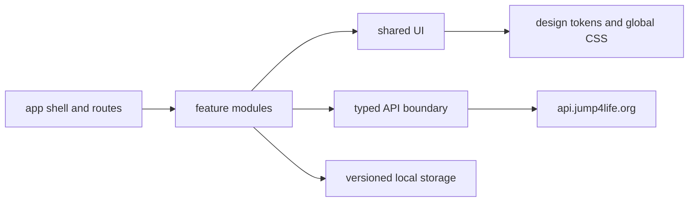

# CJS project plan

Status: approved planning baseline
Product name: **CJS (CodJumper Stats)**
Implementation status: Wave 0 baseline complete; Wave 1 foundation tasks ready

## 1. Purpose

CJS is the public statistics frontend for Call of Duty jump communities backed
by `api.jump4life.org`. It should make server activity and long-lived competitive
data easy to browse for both casual visitors and experienced players.

The initial supported sources are:

- **JumpersHeaven (`jh`)**
- **Jump4Life (`j4l`)**

The product is primarily about COD2 today. COD4 is a planned capability, not an
MVP promise. The frontend must model community source and game version as
different concepts so COD4 can be added without rewriting every feature.

## 2. Evidence and constraints

This plan is based on:

- The local prototype, which already contains servers, leaderboards, maps, map
  detail, players, player detail, favorites, and about pages.
- The sibling `../j4l-web` project, whose core stack is Node.js 26, npm, React 19,
  strict TypeScript, Vite, Lucide, authored CSS, Docker Compose/mise workflows,
  and Cloudflare Worker deployment.
- The live [CJ Stats API docs](https://api.jump4life.org/docs) and
  [OpenAPI YAML](https://api.jump4life.org/openapi.yaml), inspected on
  2026-08-15. The contract exposes 40 GET paths across Health, Leaderboards,
  Maps, Players, Replay, Tracker, and Historical tags.
- The public [CJStats reference site](https://cjstats.vercel.app/), inspected on
  2026-08-15 for information architecture and publicly observable behavior.

The API currently documents `source=jh|j4l`, FPS values
`43|76|125|250|333|0`, and several J4L-only rank/activity/replay operations. It
does not document a COD4 source or game selector. Tracker response schemas are
currently loose, so the frontend must normalize unknown payloads defensively.

## 3. Implementation decision

### Decision: incrementally rebuild the local prototype

Keep the repository, working deployment scaffold, current stack, and useful
feature knowledge. Replace or refactor code in bounded vertical slices.

Reasons:

- The prototype already uses the requested React/TypeScript/Vite stack.
- Its seven API wrapper areas call valid current endpoints.
- Its page inventory closely matches the desired MVP.
- Starting from an empty repository would discard useful behavior without
  reducing the main risks: API normalization, routing, tests, accessibility, and
  coherent styling.

This is not an endorsement of the current structure. Manual pathname branching,
large shared files, generic response casts, absent automated tests, and mixed
view/data concerns are explicitly scheduled for replacement.

### Clean-room rule

The reference site supplies product ideas such as dense filter toolbars,
responsive card/table views, favorites, and the top-level navigation. CJS will
not copy its private code, minified bundles, branding, assets, personal details,
or prose. Components and styles must be independently authored from this plan and
the CJS/J4L brand direction.

## 4. Product scope

### MVP

1. **Application shell**
   - CJS identity, responsive primary navigation, footer, API status affordance,
     source context, and accessible mobile menu.
2. **Live servers**
   - Server cards/list, source filter, populated-only filter, refresh state,
     player counts, current map, connection information where provided, and
     honest stale/error states.
3. **Leaderboards**
   - Source, board type, FPS, and supported region/time filters; sortable,
     accessible results; player links; J4L rank XP only when compatible.
4. **Maps**
   - Search, source/type/video/FPS filters, sorting, responsive cards/table, and
     stable links to details.
5. **Map details**
   - Map metadata and checkpoint/top runs by FPS with clear source context.
6. **Players**
   - Search and filtering, server-formatted names, core activity metadata, and
     stable links to profiles.
7. **Player details**
   - Performance summary, leaderboard positions, top runs, route completion,
     and J4L rank/activity data when the source supports it.
8. **Favorites**
   - Versioned local favorites for maps and players, removable individually or
     as a group, with unavailable/stale entries handled gracefully.
9. **About**
   - Independent CJS project description, data-source explanation, public
     repository link, API attribution, and no copied maintainer information.

### Post-MVP

- Replay-watch summaries and rankings.
- Historical progress and leaderboard charts.
- Rich activity sessions and rankings.
- Installable/PWA and offline enhancements.
- COD4, after the backend exposes a documented capability and test data.

### Non-goals

- Reimplementing or proxying the API backend.
- Authentication, editing player data, or administrative operations.
- Duplicating every control from the reference site when the API cannot support
  it.
- Shipping server/community-specific fields on incompatible sources merely to
  keep the screens visually symmetrical.

## 5. Experience direction

Preserve the reference site's useful information density: persistent top-level
navigation, filter-first discovery, table/card view choices, explicit refresh,
and responsive layouts. Reskin and simplify it into the J4L visual family.

Initial shared tokens should be derived from `../j4l-web`:

| Role                      | Starting value      |
| ------------------------- | ------------------- |
| Page background           | `#080b09`           |
| Elevated background       | `#0c110e`           |
| Panel                     | `#111713`           |
| Strong panel              | `#17201b`           |
| Primary text              | `#eef4f0`           |
| Muted text                | `#9ca9a1`           |
| Primary accent            | `#61d69d`           |
| Strong accent             | `#98edc3`           |
| Secondary accent          | `#d4b267`           |
| Danger                    | `#ef8178`           |
| Information               | `#8fb8e8`           |
| Small/medium/large radius | `9px / 14px / 18px` |

Design rules:

- Prefer quiet dark surfaces, crisp borders, restrained green highlights, and
  amber only for emphasis or ranking.
- Maintain a readable desktop data density without turning mobile views into
  horizontally clipped tables.
- Use one visual system for loading, empty, error, and stale states.
- Color must never be the only carrier of state. Preserve COD color-code display
  while exposing a readable plain-text name to assistive technology.
- Motion must be subtle and disabled by `prefers-reduced-motion`.

## 6. Target architecture

```text
src/
  app/                 application shell, route table, providers
  components/
    ui/                reusable primitives with no feature imports
  features/
    servers/
    leaderboards/
    maps/
    players/
    favorites/
    about/
  lib/
    api/               client, errors, endpoints, normalization
    routing/           route definitions and URL-state helpers
    storage/           versioned browser persistence
  styles/              tokens, reset, global/layout utilities
  test/                shared test setup and fixtures
```

Dependency direction:



Rules:

- `app` composes features; it does not contain domain logic.
- Features may depend on `components/ui` and `lib`, never on another feature's
  internal files. Shared domain behavior moves to `lib` or an explicit public
  feature export.
- API functions accept typed parameters and `AbortSignal`, return normalized
  domain models, and throw a structured error containing safe status/context.
- External JSON enters as `unknown`. Runtime guards/normalizers follow the
  defensive pattern already used in `j4l-web`.
- Shareable page state is encoded in path/query parameters. Detail routes become
  `/maps/:mapId` and `/players/:playerId`; legacy query routes redirect during a
  transition period.
- A small established router may be added if `CJS-003` records the dependency in
  an ADR. Do not retain direct one-time reads of `window.location.pathname`.
- API capability checks control J4L-only and future COD4 UI. Unsupported controls
  are omitted or clearly disabled; they never issue speculative requests.

## 7. API integration policy

- Default `VITE_API_BASE_URL` to `https://api.jump4life.org` and permit an
  environment override.
- Keep v1 JSON as the default. Explicit v2 JSON and MessagePack are available for transport
  benchmarks and share the same response normalization.
- Build query strings with `URLSearchParams`. Omit absent values rather than
  sending empty strings.
- Centralize timeout/cancellation, error mapping, and response parsing.
- Do not retry ordinary 4xx responses. Use bounded retry/backoff only for safe
  transient GET failures and never hide the retry state.
- Normalize loosely specified endpoints, especially Tracker data. Contract tests
  should use committed anonymized fixtures, not depend on the live API.
- Treat the OpenAPI contract as authoritative but incomplete. When actual and
  documented payloads disagree, capture a fixture, document the discrepancy,
  and fix the boundary rather than scattering optional access through views.
- Keep `source`, `game`, and `fps` as distinct types. Source support is currently
  `jh | j4l`; game support is currently `cod2` in the UI capability model.

## 8. Quality gates

The target `npm run verify` sequence is:

1. formatting check;
2. ESLint;
3. TypeScript typecheck;
4. unit/integration tests with coverage thresholds on domain logic;
5. Vite production build.

Critical browser flows also run in CI after their test harness exists. Required
test coverage includes:

- URL construction and every normalizer;
- source/capability rules;
- loading, empty, error, refresh, and success states;
- filter/query-string synchronization;
- favorites migration and malformed storage;
- keyboard navigation and direct loading of each route;
- a smoke path for servers, maps/detail, players/detail, and leaderboards.

Performance and accessibility budgets:

- No avoidable request waterfalls on a page.
- Lazy-load route-level code and heavy media where it materially reduces startup
  work.
- Provide responsive image dimensions and modern formats for owned assets.
- Meet WCAG 2.2 AA for implemented flows, including focus order, contrast,
  keyboard access, status announcements, and 200% zoom.
- Avoid layout shifts from tables, cards, images, and skeletons.

## 9. Delivery strategy

Work follows the dependency-ordered tasks in `docs/TASKS.md`. Foundation tasks
land first. Feature agents then work in separate feature directories against the
stable API/UI contracts. A final integration phase handles accessibility,
cross-browser behavior, performance, deployment, and public release readiness.

A task is complete only when its acceptance criteria, tests, documentation, and
validation commands are satisfied. Partial work stays marked `in progress` with
a concise handoff note; agents must not claim completion on build success alone.

## 10. Open product decisions

These do not block foundation work but require owner confirmation before the
affected release task:

- Final production domain and whether the visible title is `CJS`,
  `CodJumper Stats`, or both.
- Public repository and community/support links shown in the footer/about page.
- Whether region/time filters are retained when the API response cannot support
  them consistently.
- Whether future COD4 data will arrive as a new `source`, a game parameter, or a
  distinct endpoint family.
