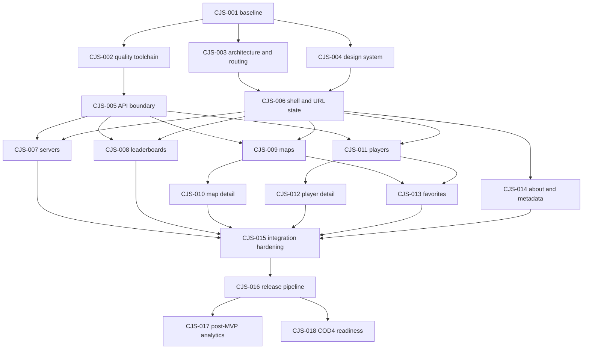

# CJS agent task backlog

This backlog is the executable delivery plan for future agents. Tasks are scoped
to minimize file overlap and may be split further, but their acceptance criteria
must not be weakened.

## Status protocol

Allowed statuses: `queued`, `ready`, `in progress`, `blocked`, `done`. `Queued`
means dependencies are not yet complete; change it to `ready` when they are.

Before coding, an agent must:

1. read `AGENTS.md` and `docs/PROJECT_PLAN.md`;
2. select a `ready` task whose dependencies are `done`;
3. change its status to `in progress` and add an owner/handoff line;
4. inspect relevant code through the codebase-memory MCP graph;
5. keep changes inside the listed boundary or document why expansion is needed.

On handoff, record validation commands and remaining risks. Mark a task `done`
only when all acceptance criteria are met.

## Dependency map



After CJS-005 and CJS-006, CJS-007 through CJS-009 and CJS-011 may run in
parallel. Each feature owns its directory and must consume shared APIs through
public exports rather than editing another feature.

## Foundation

### CJS-001 — Establish repository baseline and identity

- **Status:** done
- **Owner:** Codex / repository bootstrap session
- **Dependencies:** none
- **Primary boundary:** root configuration, package metadata, README, CI/runtime
  scaffolding; no feature redesign
- **Goal:** turn the uncommitted prototype into a reproducible CJS baseline that
  matches the J4L core stack.
- **Work:**
  - Rename package/site metadata from JH Statistics to CJS/CodJumper Stats.
  - Align Node 26, React, TypeScript, Vite, Vite React plugin, and Lucide versions
    with `../j4l-web`; regenerate the npm lockfile with the agreed versions.
  - Confirm strict TypeScript, `npm ci`, `npm run build`, `.gitignore`, environment
    example, Docker Compose/mise, SPA fallback, and Cloudflare dry-run behavior.
  - Ensure generated `dist`, `node_modules`, build info, local agent state, and
    secrets are ignored.
- **Acceptance:** a clean checkout installs with `npm ci`; `npm run build` passes;
  the built app can directly load every current path through its static host;
  package, HTML, and README consistently say CJS.
- **Validation:** `npm ci`; `npm run build`; inspect `git status --short`; run the
  documented local static-host smoke test.
- **Completed 2026-08-15:** CJS metadata and independent About content are in
  place; Node 26/npm 11 are pinned; J4L-aligned dependency ranges and the npm
  lockfile are current; nginx served every current and fallback SPA path with
  HTTP 200; Wrangler 4.114.0 completed a dry run with no bindings or deployment.
- **Completion validation:** `npm ci`; `npm run build`; static Docker image build;
  nginx route matrix; `wrangler deploy --dry-run`; ignore and public-identity
  scans. All passed.

### CJS-002 — Add the quality toolchain and CI gate

- **Status:** done
- **Owner:** Codex / CJS-002 quality-tooling session
- **Dependencies:** CJS-001
- **Primary boundary:** lint/format/test configuration, package scripts, test
  setup, CI workflow
- **Goal:** provide one deterministic local and CI verification command.
- **Work:**
  - Add ESLint for strict TypeScript/React/hooks rules and Prettier.
  - Add Vitest, React Testing Library, user-event, DOM matchers, and request
    mocking suitable for API-driven component tests.
  - Add `format`, `format:check`, `lint`, `typecheck`, `test`, `test:coverage`, and
    `verify` scripts.
  - Make CI use Node 26, `npm ci`, and `npm run verify` with dependency caching.
  - Add a minimal render test that proves the harness, not product behavior.
- **Acceptance:** intentionally malformed formatting, lint, type, and test cases
  fail the appropriate stage; `npm run verify` passes on the repository; CI has
  no sibling-repository or live-API dependency.
- **Validation:** `npm run verify`.
- **Completed 2026-08-15:** Added strict TypeScript/React/hooks/accessibility
  linting, repository-wide Prettier checks, Vitest with React Testing Library,
  user-event, DOM matchers, MSW request interception, V8 coverage, the complete
  package-script surface, Docker/mise parity, and the CI `verify` gate.
- **Completion validation:** isolated malformed formatting, lint, type, and test
  probes each failed their intended gate and were removed; local and clean
  Docker `npm ci` environments both passed `npm run verify` with 5 test files and
  25 tests; dependency audit reported zero vulnerabilities.

### CJS-003 — Introduce feature architecture and real routing

- **Status:** done
- **Owner:** Codex / wave 1 CJS-003
- **Dependencies:** CJS-001
- **Primary boundary:** `src/app`, `src/lib/routing`, route entry points, migration
  shims
- **Goal:** replace one-time pathname branching with reactive, testable routes.
- **Work:**
  - Create the target directories and public module boundaries from the project
    plan without doing page redesigns.
  - Implement a route table for `/`, `/leaderboards`, `/maps`, `/maps/:mapId`,
    `/players`, `/players/:playerId`, `/favorites`, `/about`, and a not-found page.
  - Redirect legacy `/map?mapid=` and `/player?playerid=` URLs.
  - Add an ADR if introducing a router dependency.
  - Preserve direct-load and browser back/forward behavior.
- **Acceptance:** every route is linkable and reactive; legacy links resolve;
  unknown paths render a useful 404; routing tests cover navigation, back/forward,
  direct loading, and redirects.
- **Validation:** routing test suite; `npm run build` (or `npm run verify` after
  CJS-002).
- **Completed 2026-08-15:** Added feature public exports, a typed route table,
  reactive History API navigation, nested map/player detail routes, legacy URL
  replacement redirects, and a useful not-found page without adding a router
  dependency.
- **Completion validation:** focused routing suite (18 tests), full test suite
  (25 tests), scoped ESLint and Prettier checks, `npm run typecheck`,
  `npm run build`, and direct-load HTTP 200 smoke checks for every public,
  nested, and fallback path. All CJS-003 checks passed. The repository-wide
  `npm run verify` remains pending completion of the concurrent CJS-002 and
  CJS-004 slices.

### CJS-004 — Build the J4L-aligned design system

- **Status:** done
- **Owner:** Codex / wave 1 CJS-004
- **Dependencies:** CJS-001
- **Primary boundary:** `src/styles`, `src/components/ui`, component gallery or
  test fixtures
- **Goal:** define the reskin once, before independent feature pages diverge.
- **Work:**
  - Implement tokens from the project plan for color, type, spacing, radii,
    borders, shadows, motion, layers, and breakpoints.
  - Add reset/global styles and primitives for button, link, icon button, input,
    select, segmented control, badge, panel/card, table, skeleton, empty/error
    states, pagination, and visually hidden text.
  - Document responsive table-to-card conventions and focus/error states.
  - Check normal, hover, focus-visible, disabled, loading, and destructive states.
- **Acceptance:** primitives use tokens rather than scattered literals; contrast
  and keyboard focus meet WCAG AA; mobile/desktop examples have no clipping;
  reduced motion is respected.
- **Validation:** component tests, accessibility checks, and visual inspection at
  360px, 768px, and 1440px.
- **Completed 2026-08-15:** added the tokenized J4L-aligned color, typography,
  spacing, shape, elevation, motion, layer, and breakpoint foundation; reset and
  global utilities; the full primitive set; responsive table-to-card behavior;
  usage conventions; and an interactive component gallery.
- **Completion validation:** six focused design-system tests; computed WCAG AA
  contrast checks (minimum tested ratio 5.07:1); Firefox WebDriver inspection at
  360px, 768px, and 1440px with no horizontal overflow; normal, hover,
  focus-visible, disabled, loading, destructive, and reduced-motion state checks;
  and `npm run verify` (25 tests plus production build). All passed.

### CJS-005 — Create the typed API and capability boundary

- **Status:** done
- **Owner:** Codex / wave 1 CJS-005
- **Dependencies:** CJS-002
- **Primary boundary:** `src/lib/api`, API fixtures/tests, shared domain types
- **Goal:** make API changes and malformed payloads fail at one controlled edge.
- **Work:**
  - Implement a configurable JSON client with URL encoding, cancellation,
    structured errors, bounded transient retry policy, and safe status context.
  - Add distinct `Source`, `Game`, `Fps`, and capability types. Initially expose
    `jh|j4l`, `cod2`, and the documented FPS values.
  - Add typed endpoints and normalizers needed by MVP screens: tracker servers,
    leaderboards, maps/tops, players/search/performance/positions/tops/routes, and
    source-compatible J4L rank/activity summaries.
  - Store anonymized representative fixtures and test every normalizer and URL.
  - Publish feature-facing functions through one stable API index.
- **Acceptance:** views never cast response JSON; unsupported capability calls are
  prevented before fetch; malformed fixtures return safe errors/defaults rather
  than crashing; all MVP endpoints have URL and normalization tests.
- **Validation:** API unit/contract suite; `npm run verify`.
- **Completed 2026-08-15:** added the typed `src/lib/api` boundary with distinct
  source/game/FPS/capability types, J4L capability gates, configurable safe GET
  retries, structured errors, cancellation, all MVP endpoint adapters, defensive
  normalizers, anonymized fixtures, stable exports, legacy-screen compatibility,
  and API boundary guidance.
- **Completion validation:** 28 focused API contract tests; 64 repository tests;
  current official OpenAPI and read-only JH/J4L payload compatibility checks; and
  full `npm run verify` (format, lint, typecheck, coverage, production build).
  All passed; API boundary line coverage is 93.17%.

## MVP vertical slices

### CJS-006 — Application shell, navigation, and URL-state helpers

- **Status:** done
- **Owner:** Codex / wave 2 CJS-006
- **Dependencies:** CJS-003, CJS-004
- **Primary boundary:** `src/app`, shell components, `src/lib/routing` URL helpers
- **Goal:** provide the shared frame all feature agents can target.
- **Work:** build the CJS header, desktop/mobile navigation, main landmark,
  footer, skip link, route pending indicator, page container, source context, and
  typed helpers for query-string filter state.
- **Acceptance:** keyboard/mobile navigation works; the active route is conveyed
  without color alone; filters can round-trip through encoded URLs; no copied
  branding or maintainer links remain.
- **Validation:** shell integration tests, accessibility scan, 360px and 1440px
  inspection, `npm run verify`.
- **Completed 2026-08-15:** centralized the responsive CJS shell at the router;
  added the header, desktop/mobile navigation, main landmark, skip link, pending
  indicator, page container, independent footer, and URL-backed source context;
  and published typed, defensive query-state codecs and hooks for feature
  filters.
- **Completion validation:** 27 focused shell/routing tests, axe-core with zero
  violations, keyboard and source URL round-trip integration coverage, Firefox
  inspection at 360px and 1440px with no clipping, and `npm run verify` with 10
  test files and 64 tests. All passed.

### CJS-007 — Live servers experience

- **Status:** done
- **Owner:** Codex / wave 3 CJS-007
- **Dependencies:** CJS-005, CJS-006
- **Primary boundary:** `src/features/servers`
- **Goal:** deliver the home/server dashboard against Tracker endpoints.
- **Work:** source and populated-only filters, manual refresh, optional polling
  with visibility awareness, last-updated/stale status, responsive cards/list,
  player totals, map/server information, copy/connect action only when valid.
- **Acceptance:** all async states are explicit; refresh does not blank successful
  stale data; malformed server payloads cannot crash the page; unsupported game
  filters are not shown.
- **Validation:** server normalizer and component tests with mocked success,
  partial, empty, slow, aborted, and failed responses; `npm run verify`.
- **Completed 2026-08-15:** Replaced the legacy server-page export with a
  feature-owned live dashboard covering URL-backed populated/layout filters,
  source-aware requests and links, manual refresh, optional visibility-aware
  polling, last-updated/stale feedback, responsive grid/list cards, player and
  map details, defensive partial-payload handling, and validated copy-address
  actions. Unsupported COD4/game-version controls are not rendered.
- **Contract evidence:** Checked `https://api.jump4life.org/docs` and the live
  OpenAPI contract on 2026-08-15. `/api/v1/tracker/servers` documents only the
  shared `source` parameter; its JSON response schema remains open (`{}`), so
  the feature consumes the typed CJS API boundary and applies a second safe
  display-model normalization step.
- **Completion validation:** 21 focused server model/component tests passed,
  including success, partial, empty, slow, aborted, failed, stale-refresh,
  malformed-payload, URL-state, visibility-polling, and axe coverage;
  `npm run verify` passed with 19 test files and 117 tests. Firefox layout
  inspection found no horizontal overflow at a constrained 360px content width
  or a 1440px desktop viewport.
- **Remaining risk:** The upstream Tracker JSON schema is not structurally
  specified in OpenAPI; unexpected future fields are safely ignored, while
  missing required transport fields surface the explicit error state.

### CJS-008 — Leaderboards experience

- **Status:** done
- **Owner:** Codex / CJS-008 leaderboards session
- **Dependencies:** CJS-005, CJS-006
- **Primary boundary:** `src/features/leaderboards`
- **Goal:** make supported competitive boards searchable and shareable.
- **Work:** source, board, FPS, pagination/limit, sorting where valid, player links,
  responsive table/cards, and capability-gated J4L rank XP. Retain region/time
  controls only if the API contract/data proves them meaningful.
- **Acceptance:** invalid URL combinations normalize predictably; rank XP cannot
  be selected for `jh`; changing controls updates the URL and result; table
  headers and ranking semantics are accessible.
- **Validation:** parameter matrix and UI tests; direct-load representative URLs;
  `npm run verify`.
- **Completed 2026-08-15:** Replaced the legacy page export with a typed
  leaderboards feature covering canonical URL-backed board/FPS/search/page-size/
  page/sort state; capability-safe J4L rank XP; cancellation-aware loading,
  refresh, stale, empty, and error states; stable player links; and accessible
  official-rank semantics in a responsive table/card presentation. Documented
  the live API contract at `https://api.jump4life.org/docs` and omitted the
  unsupported prototype region/time controls.
- **Completion validation:** Fourteen focused parameter-matrix and UI tests
  passed, including representative direct loads, request cancellation, URL
  normalization, sorting, paging, error/empty states, player links, and an
  axe-core scan. Repository-wide `npm run verify` passed with 19 test files and
  117 tests.
- **Remaining risk:** Automated 390px/1440px image capture was attempted, but
  concurrent stuck Firefox jobs prevented a clean screenshot in this session;
  the shared 48rem table-to-card rules, feature breakpoints, and semantic UI
  tests passed, but a later manual visual smoke check is still worthwhile.

### CJS-009 — Maps discovery experience

- **Status:** done
- **Owner:** Codex / CJS-009 maps session
- **Dependencies:** CJS-005, CJS-006
- **Primary boundary:** `src/features/maps` excluding detail-specific components
- **Goal:** provide fast map discovery with durable filters.
- **Work:** source, search, route type, media availability when supported, FPS
  difficulty, sort options based on real fields, responsive view mode, result
  count, favorites action, and links to stable detail routes.
- **Acceptance:** filter/sort combinations are deterministic and URL-backed;
  missing images/metadata degrade gracefully; large lists avoid repeated
  expensive transforms; keyboard users can reach all map actions.
- **Validation:** filter/sort unit tests, map list integration tests, mobile and
  desktop inspection, `npm run verify`.
- **Completed 2026-08-15:** Replaced the legacy list page with a typed maps
  feature slice covering URL-backed source/search/type/media/FPS/difficulty/sort,
  list/grid view and pagination; deterministic prepared-data transforms;
  cancellation-aware loading, refresh, stale, empty and error states; resilient
  metadata presentation; favorites actions; and source-stable detail links.
- **Completion validation:** Seven focused map tests passed; repository-wide
  `npm run verify` passed with 19 test files and 117 tests; headless visual
  inspection passed at 390×844 and 1440×1000 viewports.
- **Follow-up resolved:** CJS-013 replaced the temporary favorite adapter;
  CJS-010 owns the completed map-detail behavior.

### CJS-009A — Display map card artwork

- **Status:** done
- **Owner:** Codex / map-card artwork follow-up
- **Dependencies:** CJS-009
- **Primary boundary:** `src/features/maps`, focused map-list tests
- **Goal:** display the existing `/maps/cards/<mapname>.avif` artwork in map
  discovery cards while preserving a useful fallback when an asset is missing.
- **Acceptance:** map artwork loads lazily without changing link semantics;
  missing artwork falls back without broken-image UI; focused tests cover both
  paths.
- **Validation:** focused map-list tests, `npm run verify`.
- **Completed 2026-08-30:** Map discovery cards now load the existing encoded
  `/maps/cards/<mapname>.avif` asset lazily, crop it responsively, and replace a
  failed image with the original initials/map-icon fallback.
- **Completion validation:** Focused map integration tests passed for the image
  path, loading hints, and error fallback; `npm run verify` passed with 33 test
  files and 183 tests; Playwright inspection at 390×844 and 1440×1000 confirmed
  loaded artwork without card overflow or displaced controls.

### CJS-009B — Refine map result cards

- **Status:** done
- **Owner:** Codex / map-card layout refinement
- **Dependencies:** CJS-009A
- **Primary boundary:** `src/features/maps`, focused map-list tests
- **Goal:** make map results easier to scan with fully visible artwork, compact
  per-FPS difficulty ratings, and reliable newest-release ordering.
- **Acceptance:** known release dates precede unknown dates when sorting newest;
  artwork keeps its full composition; available 43/76/125/250/333 FPS ratings
  are visible without overwhelming mobile cards; list and grid layouts retain
  accessible actions and metadata.
- **Validation:** discovery sorting tests, map-list integration tests, mobile and
  desktop visual inspection, `npm run verify`.
- **Completed 2026-08-30:** Reworked list and grid cards around full 16:9 map
  artwork, a compact available-rating strip for 43/76/125/250/333 FPS, and a
  two-column completion/release summary. The selected difficulty FPS is subtly
  highlighted, and missing ratings retain an explicit empty state.
- **Completion validation:** Eight focused discovery/map-list tests passed,
  including UI-level `2026 → 2024 → Unknown` release ordering and accessible FPS
  rating labels. `npm run build` passed with performance and release-artifact
  checks. Playwright inspection passed at 390×844 and 1440×1000 in list and grid
  views with complete 960×540 artwork and no horizontal overflow.
- **Validation exception:** Repository-wide `npm run verify` reached 32 passing
  test files and 186 passing tests, then stopped on an unrelated concurrent
  players-page assertion for the `Directory 25…25` link. The map suites, lint,
  formatting, typecheck, and production build passed; rerun the full gate after
  the players slice settles.

### CJS-009C — Infinite map discovery results

- **Status:** done
- **Owner:** Codex / map infinite-scroll refinement
- **Dependencies:** CJS-009B
- **Primary boundary:** `src/features/maps`, focused map-list tests
- **Goal:** replace numbered map pagination with cumulative infinite scrolling,
  retain shareable result depth and a keyboard-accessible fallback, and make
  repeated map rows distinguishable by their route name.
- **Acceptance:** the first 96 maps render initially; approaching the result-list
  end loads the next batch automatically; a visible load-more control works when
  automatic observation is unavailable; filter changes reset result depth; and
  direct `page` query values restore all batches up to that depth without numbered
  pagination; route rows render their source-provided `ender` label when present.
- **Validation:** focused map-list tests, mobile and desktop browser inspection,
  `npm run build`, and `npm run verify`.
- **Completed 2026-08-30:** Replaced numbered pagination with a cumulative
  96-result scroll window observed 640 px before its boundary. Result depth uses
  the existing `page` query with history replacement, direct links restore every
  preceding batch, filters reset the depth, and a load-more button remains as the
  non-observer and keyboard fallback. Cards now display the API's `ender` route
  label and use `mapid:cp_id` row keys so multi-route maps remain distinct.
- **Contract evidence:** the live OpenAPI contract and JH `/api/v1/map/all`
  response were checked on 2026-08-30; `mp_12` supplies route labels such as
  `125(hard)` and `250(easy)` through the already-normalized `ender` field.
- **Completion validation:** 12 focused map discovery/list tests passed,
  including automatic loading, manual fallback, direct depth restoration,
  filter reset, absence of numbered navigation, and duplicate-name route labels.
  `npm run verify` passed with 33 files / 191 tests, coverage, formatting, lint,
  strict TypeScript, production build, performance budgets, and artifact checks.
  Chromium inspection at 390×844 and 1440×1000 confirmed 96→110 automatic
  loading, readable route labels, `page=2` restoration, and no horizontal
  overflow.

### CJS-009D — Condense map card heading metadata

- **Status:** done
- **Owner:** Codex / map-card heading refinement
- **Dependencies:** CJS-009C
- **Primary boundary:** `src/features/maps`, focused map-list tests
- **Goal:** keep route and verified-video identity beside the map name while
  removing redundant lower card badges.
- **Acceptance:** route names render inline in parentheses using the established
  accent; maps with a safe media URL expose an accessible YouTube icon beside
  the title; maps without media show no placeholder; and route-type/category
  badges no longer appear on cards.
- **Validation:** focused map-list tests, mobile and desktop browser inspection,
  `npm run build`, and `npm run verify`.
- **Completed 2026-08-30:** Moved route names beside the map title in the existing
  route accent, added an accessible red Lucide video control only for sanitized
  media URLs, and removed the redundant media placeholder and route-type badges
  from map cards. Media filter wording remains unchanged outside the cards.
- **Completion validation:** 16 focused map-list, discovery, and media-model tests
  passed. `npm run verify` passed with 33 files / 191 tests, coverage, formatting,
  lint, strict TypeScript, production build, performance budgets, and artifact
  checks. Chromium inspection at 390×844 and 1440×1000 confirmed inline route
  titles, title-adjacent video links, absent lower badges, and no horizontal
  overflow.

### CJS-009E — Compact map discovery defaults

- **Status:** done
- **Owner:** Codex / compact map discovery refinement
- **Dependencies:** CJS-009D
- **Primary boundary:** `src/features/maps`, focused map discovery tests
- **Goal:** reduce the space used before map results and make the preferred
  discovery presentation the default.
- **Acceptance:** difficulty status is removed from map discovery state and UI;
  newest release and card/grid view are the defaults and reset targets; the
  heading and filter panel use a compact responsive layout without losing labels,
  keyboard access, or URL-backed non-default selections.
- **Validation:** focused map tests, desktop and mobile Chromium inspection,
  `npm run build`, and `npm run verify`.
- **Completed 2026-08-30:** Removed difficulty-status URL state and filtering,
  changed the canonical defaults and reset targets to newest release plus grid
  cards, and compacted the discovery heading, panel padding, control gaps, and
  responsive filter grid. Non-default sort, FPS, media, route, search, and list
  selections remain URL-backed.
- **Completion validation:** 12 focused map discovery/page tests passed.
  `npm run verify` passed with 34 files / 196 tests, coverage, formatting, lint,
  strict TypeScript, production build, performance budgets, and artifact checks.
  Chromium inspection at 390×844, 1440×1000, and 2048×1024 confirmed the new
  defaults, absent difficulty-status control, one-row desktop controls, compact
  two-column mobile controls, keyboard labels, and no horizontal overflow.

### CJS-010 — Map detail and top runs

- **Status:** done
- **Owner:** Codex / CJS-010 map-detail session
- **Dependencies:** CJS-009
- **Primary boundary:** map detail files within `src/features/maps`
- **Goal:** turn `/maps/:mapId` into a complete, shareable map record.
- **Work:** metadata summary, available FPS/checkpoint selection, top runs,
  player links, source context, valid media/replay links if supplied, and a clear
  unavailable map state.
- **Acceptance:** route changes cancel obsolete requests; selected FPS/checkpoint
  is shareable; no stale run list is presented as another map's data; missing
  fields do not produce broken labels.
- **Validation:** route/data race tests, API error states, deep-link smoke test,
  `npm run verify`.
- **Completed 2026-08-15:** Replaced the legacy detail export with a feature-owned
  map record covering source-stable metadata, URL-backed FPS/checkpoint
  selection, checkpoint-aware top runs, safe player links and plain COD names,
  validated media URLs, favorites continuity, and explicit loading, unavailable,
  catalog-error, run-error, and empty states. Map and run requests are separately
  keyed and cancelled so stale route or selection data is never relabeled.
- **Contract evidence:** Rechecked the live API docs, OpenAPI contract, and
  non-identifying payload structure on 2026-08-15. `/api/v1/map/all` documents
  `source`; `/api/v1/map/tops` documents `source`, `fps`, `cpid`, and optional
  `limit`. The contract supplies no replay URL, so the UI does not invent one and
  only exposes HTTP(S) map media URLs actually present in normalized data.
- **Completion validation:** Eleven focused model/component tests passed,
  including route and FPS races, request cancellation, URL checkpoint state,
  partial endpoint failure, unavailable/error states, and a direct nested-route
  load. Repository-wide `npm run verify` passed with 26 test files and 156 tests.
  Headless Firefox found no document overflow in the 390px loading state, the
  fully rendered 500px compact record/table, or the 1440px desktop record/table.
- **Remaining risk:** The live J4L top-runs endpoint can return HTTP 500 for an
  otherwise valid checkpoint; the map remains usable and the failure is confined
  to a retryable runs panel. Replay links remain omitted until the API publishes
  a URL contract.

### CJS-010A — Refine map profile routes and top-run selection

- **Status:** done
- **Owner:** Codex / map-profile refinement follow-up
- **Dependencies:** CJS-010, CJS-009A
- **Primary boundary:** map detail files within `src/features/maps`, shared map
  image resolver, and focused map-detail tests
- **Goal:** make map profiles artwork-led and route-aware, with immediately
  visible FPS availability and a useful no-tops state.
- **Acceptance:** the profile displays map artwork with a safe fallback; release
  metadata sits with the author; route controls and labels replace checkpoint
  language and appear only for multi-route maps; 125/250/333/mix are individual
  URL-backed buttons, FPS values without tops are disabled, and default selection
  falls back through 125, 250, 333, then mix; empty top-run requests present a
  map/FPS-specific no-tops state, while failed requests preserve the profile and
  offer a safe retry without exposing raw API errors.
- **Validation:** focused model/component tests, mobile and desktop inspection,
  `npm run build`, and `npm run verify`.

### CJS-011 — Player discovery experience

- **Status:** done
- **Owner:** Codex / CJS-011 players session
- **Dependencies:** CJS-005, CJS-006
- **Primary boundary:** `src/features/players` excluding profile-specific files
- **Goal:** make players discoverable without overwhelming the browser or API.
- **Work:** source-aware name search, documented list metadata, stable sorting,
  COD color rendering with accessible text, badges only when backed by data,
  favorites action, responsive result view, and profile links.
- **Acceptance:** search is debounced/cancelled as appropriate; unsafe game color
  input is rendered as text spans only; unsupported inferred badges are removed;
  result state is URL-backed.
- **Validation:** search race tests, name/color parser tests, component tests,
  `npm run verify`.
- **Completed 2026-08-15:** Replaced the eager legacy directory with a typed
  player feature that uses the bounded, source-aware name endpoint; debounces
  and cancels obsolete requests; keeps search/source/sort state shareable;
  presents documented country, visits, and last-seen metadata; renders COD color
  controls as accessible React text spans; omits inferred role/status badges;
  and provides source-stable profile links and favorites actions.
- **Completion validation:** Eleven focused parser, stable-sort, request-race,
  URL-state, safety, favorites, and component tests passed. Repository-wide
  `npm run verify` passed with 19 test files and 117 tests; headless visual
  inspection passed at 390×844 and 1440×1000 viewports with no horizontal
  clipping or lost controls.
- **Follow-up resolved:** CJS-013 replaced the temporary favorite adapter;
  CJS-012 owns the completed profile behavior.

### CJS-012 — Player profile and performance

- **Status:** done
- **Owner:** Codex / CJS-012 player-profile session
- **Dependencies:** CJS-011
- **Primary boundary:** profile files within `src/features/players`
- **Goal:** provide a stable profile view that adapts to each source's capability.
- **Work:** identity/activity summary, performance stats, leaderboard positions,
  top runs, route completion, J4L rank/activity summary, source switch behavior,
  map links, and unavailable/deleted player handling.
- **Acceptance:** requests cancel on player/source changes; J4L-only sections are
  capability-gated; partial endpoint failure leaves unaffected sections usable;
  heading/landmark order remains coherent.
- **Validation:** partial-failure integration tests, capability matrix, deep-link
  smoke test, `npm run verify`.
- **Handoff:** Replaced the legacy profile export with a feature-owned,
  responsive profile view. Common and J4L-only endpoints settle independently,
  keep stale data visible during refresh failures, and abort on superseding
  player/source/filter requests. Source, FPS, and leaderboard choices remain in
  the URL; top-run checkpoint links and route-completion map links use their
  corresponding map lookup contracts. Invalid links, API `404` responses, empty
  sections, and partial/all-endpoint failures have deliberate UI states.
- **Contract evidence:** Checked `https://api.jump4life.org/docs` and the live
  OpenAPI contract on 2026-08-15. Profile endpoint/parameter and capability notes
  are recorded in `src/features/players/README.md`; XP rank and activity summary
  remain capability-gated to `source=j4l`.
- **Tests:** Added focused profile model and integration coverage for deep-linked
  filters, source capability gating, map links, partial failure, request
  cancellation, deleted/unavailable players, and malformed player IDs. All 152
  tests across 25 files pass through `npm run verify`.

### CJS-012A — Sparse player profile states

- **Status:** done
- **Owner:** Codex / sparse-profile follow-up
- **Dependencies:** CJS-012
- **Primary boundary:** player-performance normalization and focused profile UI
- **Goal:** present valid low-activity player data as an expected profile state,
  without hiding genuine transport or malformed-response failures.
- **Acceptance:** the live JumpersHeaven empty `best_fps` sentinel normalizes as
  no ranked FPS; zero rank sentinels do not render as real placements; sparse
  profiles retain useful completion and last-seen data, including sub-one-percent
  precision beside their completed-route count; recent-record copy makes the
  expected new-player state clear; jump-score responses that omit
  `map_scores` render as no ranked runs at the selected FPS; actual resource
  failures still use the retryable error treatment.
- **Validation:** normalizer and player-profile integration tests, desktop and
  mobile browser inspection, `npm run build`, and `npm run verify`.
- **Completed 2026-08-30:** Normalized the live JH empty `best_fps`, zero-rank,
  and omitted `map_scores` sentinels without relaxing validation for malformed
  non-empty values. Sparse overview data now shows unranked labels, expected
  recent-record copy, and `3 completed · 0.47%` rather than a rounded `0%`;
  best-runs views render a normal selected-FPS empty state instead of a profile
  outage. Real rejected requests retain the existing retryable error treatment.
- **Contract evidence:** Live JH player `143872` was checked on 2026-08-30.
  Performance publishes `best_fps: ""`, rank zeros, three completed routes, and
  `maps_completed_ratio: 0.00473186119873817`; jump-score responses omit
  `map_scores` at every supported FPS. The live OpenAPI contract documents both
  endpoints but leaves jump-score response shape open.
- **Completion validation:** Three focused normalizer/model/profile suites passed
  with 41 tests. `npm run verify` passed with 34 files / 201 tests, coverage,
  lint, formatting, strict TypeScript, production build, performance budgets,
  and artifact checks. Live Chromium inspection at 390×844 and 1440×1000 showed
  no error panels, console errors, or horizontal overflow on overview or best
  runs.

### CJS-013 — Versioned favorites

- **Status:** done
- **Owner:** Codex / CJS-013 favorites integration session
- **Dependencies:** CJS-009, CJS-011
- **Primary boundary:** `src/features/favorites`, `src/lib/storage`, favorite
  controls exposed by maps/players
- **Goal:** make local favorites reliable across schema changes and sources.
- **Work:** versioned storage schema keyed by entity type/source/id, safe parser
  and migration, add/remove/clear operations, cross-tab updates, unavailable
  entity behavior, maps/players tabs, and empty state.
- **Acceptance:** malformed storage never crashes startup; same numeric ID from
  two sources cannot collide; actions are keyboard-accessible and update across
  open tabs; migration tests preserve valid legacy entries.
- **Validation:** storage/migration unit tests, cross-tab integration test,
  `npm run verify`.
- **Completed 2026-08-15:** Added a source-qualified version 1 favorites document,
  safe parsing and legacy-key migration, add/remove/toggle/type-clear operations,
  same-tab and cross-tab subscriptions, and an unavailable-snapshot fallback.
  Rewired map discovery/detail and player search/profile controls to the shared
  store. Replaced the legacy screen with feature-owned URL-backed keyboard tabs,
  source-aware map/player cards, individual and group removal, empty states,
  live counts, and explicit stale/local-data guidance.
- **Completion validation:** Four storage/migration/cross-tab tests and three
  favorites page tests pass, including source-collision, unavailable-entry,
  keyboard navigation, and axe-core coverage. The six affected map/player suites
  also pass. Repository-wide `npm run verify` passes with 28 test files and 163
  tests, plus the production build.
- **Remaining risk:** Firefox screenshot validation at 390×844 and 1440×1000 was
  attempted with populated source-collision and unavailable-entry fixtures, but
  the environment's headless software compositor could not map a framebuffer.
  Responsive CSS, semantic rendering, keyboard behavior, and axe-core checks
  passed; a later manual visual smoke check remains worthwhile.

### CJS-014 — About, metadata, and public-project content

- **Status:** done
- **Owner:** Codex / CJS-014 about-and-metadata session
- **Dependencies:** CJS-006
- **Primary boundary:** `src/features/about`, document metadata, public static
  metadata assets
- **Goal:** clearly explain CJS ownership, data provenance, and limitations.
- **Work:** independently written about page, links approved by the owner, API and
  community attribution, privacy/local-storage note, open-source repository link,
  per-route titles/descriptions, favicon/social metadata using owned assets.
- **Acceptance:** no reference-site maintainer data or wording remains; links are
  valid and safe; every route has a useful title; local-storage/API behavior is
  accurately described.
- **Validation:** metadata/content tests, link review, `npm run verify`.
- **Completed 2026-08-15:** Replaced the legacy About export with a feature-owned,
  independently written page covering CJS ownership, public API provenance,
  browser-local favorites, supported source/game scope, capability limitations,
  and verified public project/API/community links. Added route-aware title,
  description, canonical, Open Graph, and Twitter metadata plus owned favicon,
  manifest, and social-card assets.
- **Completion validation:** Nineteen focused content, metadata, routing, and axe
  tests passed; all four external links returned HTTP 200; Firefox inspection at
  390×844 and 1440×1000 found no clipping; `npm run verify` passed with 25 test
  files and 152 tests.

## Integration and release

### CJS-015 — Accessibility, responsive, and end-to-end hardening

- **Status:** done
- **Owner:** Codex / CJS-015 integration-hardening session
- **Dependencies:** CJS-007, CJS-008, CJS-010, CJS-012, CJS-013, CJS-014
- **Primary boundary:** cross-feature fixes, E2E configuration/tests, performance
  budgets
- **Goal:** make the assembled MVP dependable as one product.
- **Work:** critical-path browser tests, automated accessibility checks, manual
  keyboard/zoom/reduced-motion review, small/large viewport pass, slow/error
  network pass, route-level lazy loading where valuable, image/layout-shift
  review, and removal of dead prototype code.
- **Acceptance:** servers, leaderboards, map discovery/detail, player
  discovery/profile, and favorites smoke flows pass; no serious automated a11y
  violations; no horizontal page overflow at 320px or 200% zoom; production build
  has no unexpected console errors.
- **Validation:** `npm run verify`; E2E suite; documented manual browser matrix;
  production bundle inspection.
- **Completed 2026-08-15:** Added strict production-preview Playwright flows for
  every critical product area across Chromium, Firefox, and WebKit; browser axe,
  console/page-error, 320px, 200%-scale, reduced-motion, keyboard, focus, retry,
  persistence, and nested-refresh checks; route focus/status and chunk-failure
  recovery; mobile sorting and contrast fixes; keyed async cancellation; lazy
  feature routes; enforced manifest-based bundle budgets; and dead prototype/CSS
  removal.
- **Completion validation:** `npm run verify` passes with 30 Vitest files and 167
  tests, the 27-test three-engine browser matrix passes, and every production
  bundle metric remains below its checked ceiling. The browser/manual review and
  measurements are recorded in [CJS-015-VALIDATION.md](CJS-015-VALIDATION.md).
- **Remaining risk:** The headless environment cannot provide a physical screen
  reader session. Live-region content, focus behavior, semantic markup, browser
  axe results, and three-engine behavior are covered; an NVDA/Firefox or
  VoiceOver/Safari listening smoke remains worthwhile before public release.

### CJS-016 — Public release and deployment pipeline

- **Status:** done
- **Owner:** Codex / CJS-016 public-release session
- **Dependencies:** CJS-015
- **Primary boundary:** GitHub workflows, Cloudflare configuration, release docs;
  production mutation requires explicit owner authorization
- **Goal:** make public contributions and owner-controlled releases safe.
- **Work:** finalize CODEOWNERS/Dependabot, PR template, security/contribution
  guidance, CI branch gate, Cloudflare dry run, SPA asset caching/headers, source
  maps policy, release checklist, rollback notes, and production domain decision.
- **Acceptance:** a fork can build/test without secrets or sibling repos;
  deployment remains disabled by default until owner configuration; dry run
  succeeds; no credentials or internal artifacts are tracked.
- **Validation:** fresh-checkout `npm ci && npm run verify`; Wrangler dry run;
  workflow syntax/security review. Do not deploy without explicit approval.
- **Completed 2026-08-15:** Added owner-review boundaries, grouped Dependabot
  updates, contribution/security guidance, a pull request template, an accepted
  release-boundary ADR, and an owner-only release/rollback runbook. Preserved the
  protected `Build and validate` check while extending CI with the three-engine
  browser suite and pinned Cloudflare dry run. Deployment now consumes the exact
  successful `main` revision, validates its custom-domain/secrets configuration,
  remains kill-switch gated, and performs a post-deploy route/header/cache smoke.
  Added Cloudflare/nginx security headers, immutable fingerprinted-asset caching,
  explicit no-source-map policy, upload exclusions, and enforced release-artifact
  checks. Enabled GitHub private vulnerability reporting.
- **Completion validation:** An isolated source copy passed `npm ci` and
  `npm run verify` with 30 test files / 167 tests; Wrangler 4.114.0 strict dry run
  succeeded with no bindings or deployment; actionlint, gitleaks, npm audit,
  Docker/nginx syntax, nested SPA fallback, security-header, and immutable-cache
  checks passed. Evidence and owner-only first-release actions are recorded in
  [CJS-016-VALIDATION.md](CJS-016-VALIDATION.md).
- **Owner decision resolved 2026-08-30:** the repository is published under the
  MIT License. Remaining owner decisions are to choose the dashboard-managed
  HTTPS domain, set
  `CJS_PRODUCTION_URL` and least-privilege production secrets, then explicitly
  authorize enabling the currently false deployment gate. No production release
  or Cloudflare configuration mutation was performed for this task.

### CJS-019 — Server browser readability refinement

- **Status:** done
- **Owner:** Codex / server-card readability session
- **Dependencies:** CJS-007, CJS-015
- **Primary boundary:** `src/features/servers`, `public/maps/cards`, focused
  server fixtures/tests
- **Goal:** make the combined live-server browser scannable without hiding
  connection or roster details.
- **Work:** display both documented sources with Jump4Life first, strengthen the
  map-led card hierarchy, add derived country context and selectable/copyable
  addresses, and remove redundant mode/player-count facts from individual cards.
- **Acceptance:** both source feeds remain independently cancellable and expose
  partial failures; map, country, hostname, address, status, and roster content
  remain readable over artwork; source-correct map links and clipboard feedback
  work with keyboard and assistive technology; grid/list layouts do not clip at
  mobile or desktop widths.
- **Validation:** focused server model/component tests, accessibility checks,
  responsive browser inspection, `npm run verify`.
- **Completed 2026-08-22:** Replaced the single-source card wall with independent
  J4L/JH feeds grouped in a fixed J4L-first order, aggregate totals, and
  source-local loading/error/refresh handling. Rebuilt cards around prominent
  map artwork and names, hostname-derived country flags, selectable addresses,
  compact copy actions, and rosters while removing redundant mode/player-count
  facts. Imported the 609 tracked AVIF card images from the owned sibling
  `j4l-web` asset library and resolve them directly by map name, with lazy
  loading and the original 15 KB WebP as a decode/missing-image fallback.
- **Contract evidence:** Rechecked the live API docs and OpenAPI contract on
  2026-08-22. `/api/v1/tracker/servers` remains source-specific with the
  documented `source=j4l|jh` parameter and an open JSON schema; no map-image or
  country field/endpoint is published. Country labels are therefore explicitly
  derived from known hostname prefixes, with an honest unknown-region fallback.
- **Completion validation:** 21 focused server tests pass, including dual-source
  loading/order, source-correct links, flags, address presentation, redundant
  fact removal, independent cancellation/polling, partial failures, clipboard,
  URL state, image URL/fallback behavior, and axe coverage. The focused server
  lint and 21 tests pass; `npm run build` passes with production performance and
  artifact budgets covering 638 release files. Chromium inspection against live
  payloads at 360×800 and 1440×1000 found 24 cards, decoded every available
  exact-match map image at 960px intrinsic width, and found no console errors or
  horizontal overflow. A final repository-wide `npm run verify` rerun is pending
  completion of the concurrent CJS-020 leaderboard edits; its current lint stop
  is outside this task boundary.
- **Refined 2026-08-22:** Removed the visible hero, aggregate summary, and
  refresh-status rows so the page begins with compact controls and the J4L-first
  server list. Removed the full-image gradient, reduced control sizing and mobile
  wrapping, and standardized unknown or empty rosters as “Server empty.” A
  follow-up removed experimental label backplates and dark-name outlines in
  favor of plain white map names and a lighter roster-row surface. Chromium
  inspection at 360×800 and 1440×1000 found no full-image overlay, no horizontal
  overflow, and only the toolbar plus server groups in normal page flow.
- **Interaction follow-up 2026-08-22:** Replaced the separate copy button with a
  keyboard-accessible address row that explains “Click to copy” and confirms the
  result without hiding the IP. A later refinement removed the redundant “View
  map profile” cue; supported map names remain the link itself.
- **Density follow-up 2026-08-22:** Removed the light per-player roster boxes in
  favor of compact, unframed name-and-ping rows. The card view now uses four
  columns on wide desktop screens and steps down to three, two, and one column
  without clipping at narrower widths.
- **Game-filter follow-up 2026-08-22:** Added a URL-backed COD2/COD4 segmented
  filter using the live tracker feed's `game_type` discriminator. COD2 remains
  the default across both sources; COD4 is capability-gated to the JH group and
  does not link into COD2-only map profiles. The live JH feed exposed 13 COD2
  and 11 COD4 cards during validation. The focused server suite passes with 22
  tests, the production build passes, and Chromium checks at 390×844 and
  1440×1000 found no console errors or horizontal overflow.

### CJS-020 — Leaderboard presentation refinement

- **Status:** done
- **Owner:** Codex / leaderboard revamp session
- **Dependencies:** CJS-008, CJS-015
- **Primary boundary:** `src/features/leaderboards`, focused leaderboard tests
- **Goal:** make leaderboard choices and player performance easier to scan.
- **Work:** replace select-heavy board/FPS controls with visible option groups,
  reduce country presentation to a compact flag, restore the API-provided top
  1–10 distribution, and refine the responsive results layout.
- **Acceptance:** every supported board and FPS choice is directly visible and
  URL-backed; country remains accessible without dominating a row; top-place
  counts 1–10 are readable in table and mobile layouts; unsupported J4L/JH
  combinations remain capability-gated.
- **Validation:** focused model/component tests, accessibility scan, responsive
  browser inspection at mobile and desktop widths, `npm run verify`.
- **Completed 2026-08-22:** Replaced board and FPS selects with directly visible,
  keyboard-operable choices while preserving canonical URL state and source
  capability rules. Moved country into a compact accessible flag beside each
  player and restored a responsive top-1-through-top-10 count strip with relative
  bars. Kept rank XP progress and board-specific metric/points columns distinct.
- **Contract evidence:** Rechecked a live, anonymized
  `/api/v1/leaderboard/speed-skill?source=jh&fps=125` response on 2026-08-22; the
  existing `top_list` boundary supplies numeric string keys `1` through `10`, so
  no endpoint or transport change was required.
- **Completion validation:** 16 focused model/component tests pass, including
  visible filter URL behavior, compact flag semantics, all ten top positions,
  cancellation, and axe coverage. `npm run verify` passes with 30 files / 169
  tests and production budgets. Live Chromium inspection at 390×844 and
  1440×1000 found no clipped choices, console errors, or horizontal overflow;
  the 320px E2E leaderboard reflow and keyboard checks passed. The broader
  multi-route responsive test still records an unrelated mocked J4L tracker 500
  from the concurrent server-browser slice.
- **Refined 2026-08-22:** Restyled country markers as flat circular SVG flags
  with podium rims matching the observable reference treatment. The
  zero-dependency MIT `circle-flags` package is bundled locally so rendering is
  consistent without an external runtime service or platform emoji. Removed
  page-size and pagination controls in favor of 25-player progressive batches
  loaded as the scroll sentinel approaches, with a keyboard-operable load-more
  fallback. Legacy `page` and `limit` parameters are now removed from shared
  URLs. Enlarged table labels and values, made uncolored player names white
  without an underline, and retained explicit API-provided COD2 name colors.
- **Follow-up validation:** 17 focused model/component tests pass, including
  observer-triggered loading and legacy pagination URL cleanup. The production
  build passes, and the full `npm run verify` gate passes with 32 files / 174
  tests. Live Chromium checks at 390×844 and 1440×1000 found no console errors
  or horizontal overflow; a mobile scroll expanded 25 initial rows to all 32
  live results automatically.

### CJS-021 — Shared COD2 player-name rendering

- **Status:** done
- **Owner:** Codex / COD2-name rendering session
- **Dependencies:** CJS-007, CJS-008, CJS-010, CJS-012, CJS-013
- **Primary boundary:** shared COD2 name parser/renderer and player-name callsites
  in servers, maps, players, leaderboards, and favorites
- **Goal:** preserve and display API-provided COD2 caret colors consistently
  wherever a player name appears.
- **Work:** centralize the `^0`–`^9` parser and canonical COD2 palette, normalize
  duplicated caret encodings used by the legacy feed, keep plain names for
  filtering and accessible labels, and replace feature-local stripping/rendering.
- **Acceptance:** raw color controls never appear visually; all ten COD2 colors
  match the owned J4L reference implementation; malformed controls remain safe
  literal text; screen readers receive one plain name; server rosters, map runs,
  player search/profile, leaderboards, and saved players use the shared renderer.
- **Validation:** focused parser/component and affected feature tests,
  accessibility scan, responsive browser inspection, `npm run verify`.
- **Completed 2026-08-22:** Centralized COD2 name parsing and rendering in shared
  code, including the canonical `^0`–`^9` palette and duplicated-caret
  normalization from the owned J4L implementation. Server payload normalization
  now preserves encoded names, and servers, map runs, player search/profile,
  leaderboards, and favorite players all render the shared component. Plain
  decoded names remain available for sorting, filtering, announcements, row
  labels, and assistive technology.
- **Completion validation:** 12 focused files / 72 tests pass across the parser,
  shared component, and every affected feature; the full `npm run verify` gate
  passes with 32 files / 174 tests, coverage, lint, formatting, production build,
  performance budgets, and release-artifact checks. Live Chromium inspection at
  360×800 and 1440×1000 rendered 24 server cards and 13 colored name segments
  using the expected computed palette, with no console errors or horizontal
  overflow.

### CJS-022 — Progressive player directory

- **Status:** done
- **Owner:** Codex / progressive player-directory session
- **Dependencies:** CJS-011, CJS-021
- **Primary boundary:** player discovery files within `src/features/players`
- **Goal:** make `/players` useful before a search while keeping the full directory
  inexpensive to render.
- **Work:** load the documented player list ordered by last seen when no search is
  active, preserve bounded name search, and reveal directory rows incrementally
  as the user scrolls with an accessible manual fallback.
- **Acceptance:** the default route shows last-seen players; source/query/sort
  changes cancel obsolete requests; only an initial batch is rendered until the
  scroll sentinel advances; search behavior and stable profile/favorite actions
  remain intact.
- **Validation:** request-race and progressive-render component tests; mobile and
  desktop inspection; `npm run verify`.
- **Completed 2026-08-22:** The default `/players` route now requests the
  documented directory with `sort=last-seen`, while meaningful name queries keep
  using the bounded search endpoint. Results render 50 at a time and advance
  through an Intersection Observer sentinel with an accessible Load more button
  fallback. Source/query/sort changes retain cancellation and stale-state
  handling, and local sorting, profile links, colored names, and favorites remain
  intact.
- **Completion validation:** 11 focused player discovery, progressive-render,
  and request-race tests passed. Repository-wide `npm run verify` passed with 32
  files / 174 tests, coverage, lint, formatting, strict TypeScript, production
  build, performance budgets, and release-artifact checks. Live Chromium checks
  at 390×844 and 1440×1000 displayed the current 8,813-player JH directory in an
  initial 50-row/card batch with no clipping or horizontal overflow.
- **Remaining risk:** The published `/api/v1/player/all` contract has no cursor,
  offset, or limit, so progressive loading bounds browser rendering rather than
  network payload size. True network pagination requires a future API contract.

### CJS-023 — Player profile information architecture refinement

- **Status:** done
- **Owner:** Codex / player-profile refinement session
- **Dependencies:** CJS-012, CJS-021
- **Primary boundary:** player profile files within `src/features/players`, the
  documented jump-score adapter in `src/lib/api`, source-switch behavior for the
  player-detail route in `src/app/shell`, and corresponding browser fixtures
- **Goal:** treat source-qualified player IDs as distinct identities and make the
  profile easier to scan.
- **Work:** prevent source switching from reusing a player ID; split overview,
  best runs, and route completion into URL-backed views; surface common recent
  activity and richer J4L-only rank/activity data on the overview; refine the
  responsive visual hierarchy.
- **Acceptance:** changing source from a profile opens player discovery for the
  new source; tabs are keyboard-accessible and deep-linkable; JH never requests
  J4L-only resources; loading, empty, error, stale, and partial states remain
  deliberate in every view.
- **Validation:** focused profile and shell tests, mobile/desktop inspection,
  `npm run verify`.
- **Completed 2026-08-22:** Source changes from a profile now return to player
  discovery so source-specific numeric IDs are never reused. The profile has
  URL-backed Overview, Best runs, and Route completion views. Overview combines
  common performance/recent records with richer J4L rank and cumulative
  activity. Best runs now consumes `/api/v1/player/jump-scores`, showing total
  jump-skill points/rank and each scoring map's points, rank, and difficulty.
- **Contract evidence:** Rechecked the live docs and OpenAPI contract on
  2026-08-22 and sampled read-only JH/J4L jump-score payloads. Both sources
  publish the same `map_scores` fields used by the view.
- **Completion validation:** 45 focused API/profile/shell tests passed. The full
  `npm run verify` gate passed with 33 files / 181 tests, formatting, lint,
  coverage, strict TypeScript, production build, performance budgets, and
  release-artifact checks. Focused Chromium validation at 320×800 and 1440×1000
  confirmed visible skill points and no horizontal overflow.

### CJS-024 — Server card metadata contrast

- **Status:** done
- **Owner:** Codex / server-card metadata polish session
- **Dependencies:** CJS-019
- **Primary boundary:** `src/features/servers/servers.css`
- **Goal:** improve country and current-map readability over map artwork.
- **Completed 2026-08-22:** Removed the framed backdrop from server country
  flags, increased the flag glyph size, and gave the Current map label the same
  bright foreground and subtle text shadow used by the map name.
- **Validation:** focused formatting/lint checks and `npm run build`.

### CJS-025 — Shared circular country flags

- **Status:** done
- **Owner:** Codex / shared country-flag session
- **Dependencies:** CJS-020, CJS-023, CJS-024
- **Primary boundary:** shared country-flag UI and country displays in servers and
  players
- **Goal:** replace platform-dependent flag emoji and plain country cells with
  the locally bundled Circle Flags artwork already adopted by leaderboards.
- **Acceptance:** server cards, player discovery, and player profiles use one
  accessible shared flag component; invalid or unavailable codes fall back to a
  globe without broken images; country text remains available where useful.
- **Validation:** shared component and affected feature tests, responsive visual
  inspection, `npm run verify`.
- **Completed 2026-08-22:** Added one shared, size-aware country flag component
  backed by the locally emitted Circle Flags SVGs, including `UK` to `GB`
  normalization and an accessible globe fallback for invalid or failed artwork.
  Server cards now use large circular flags; player discovery rows pair compact
  flags with country codes; and profile identity metadata pairs the flag with the
  full country label.
- **Completion validation:** 26 focused shared UI, server, player-list, and player
  profile tests passed. Formatting and repository lint passed; `npm run build`
  passed strict TypeScript, Vite production output (including local country flag
  assets), performance budgets, and release-artifact checks. Live Chromium at
  1440×1000 verified circle flags on servers, the 8,813-player JH directory, and
  a populated JH profile without clipping or broken artwork.
- **Remaining validation:** The full `npm run verify` command reached coverage but
  is currently blocked by two unrelated concurrent player jump-score tests whose
  one-item array expectations were not updated when their shared fixture grew to
  two items. This slice's affected suites remain green.

### CJS-026 — Player run controls and shared player-link interaction

- **Status:** done
- **Owner:** Codex / player interaction polish session
- **Dependencies:** CJS-020, CJS-023
- **Primary boundary:** player profile run filters and shared player-link styling
- **Goal:** make FPS choices immediately visible on Best runs and give linked
  player names one consistent, neutral hover treatment throughout the site.
- **Acceptance:** Best runs exposes one keyboard-accessible button per supported
  FPS value; its key data is easier to read; player links no longer switch to the
  generic green-and-underline treatment and match the leaderboard interaction.
- **Validation:** affected component tests, mobile/desktop browser inspection,
  `npm run verify`.
- **Completed 2026-08-22:** Replaced the Best runs FPS dropdown with six visible
  segmented buttons. The controls use radio semantics, roving keyboard focus,
  concise labels, and a 3×2 phone layout. Increased the run summary and table
  typography. Added a shared neutral player-link variant and applied it to
  leaderboards, player discovery, map records, and favorite players, eliminating
  generic accent-green and underline hover styling.
- **Completion validation:** 23 focused profile, discovery, leaderboard, and
  favorites tests passed before the full repository gate. `npm run verify` passed
  with 33 files / 182 tests, coverage, formatting, lint, strict TypeScript,
  production build, performance budgets, and release-artifact checks. Live
  Chromium checks at 320×800 and 1440×1000 confirmed all FPS choices remain
  readable without page overflow and the larger skill-point hierarchy is clear.

### CJS-027 — Navigation pending-state lifecycle

- **Status:** done
- **Owner:** Codex / navigation pending-state fix
- **Dependencies:** CJS-006, CJS-015
- **Primary boundary:** `src/app`, `src/lib/routing`, focused routing tests
- **Goal:** ensure the shared route progress indicator clears after every
  completed client-side navigation, including query-only filter and view changes.
- **Acceptance:** pathname, query-string, hash, and legacy redirect navigation
  commits cannot leave the shell busy or the progress bar active; pathname-only
  focus and page announcements keep their existing behavior.
- **Validation:** focused router tests and `npm run verify`.
- **Completed 2026-08-30:** Keyed route readiness to the complete browser
  location rather than the routed pathname alone. Query-only filter/view changes,
  hash changes, and canonical legacy redirects now clear the shared pending state
  after the rendered route commits, while focus and page announcements remain
  limited to pathname changes.
- **Completion validation:** 8 focused AppRouter/browser-routing tests passed,
  including query/hash and legacy-redirect pending-state regressions. The full
  `npm run verify` gate passed with 33 files / 183 tests plus formatting, lint,
  coverage, strict TypeScript, production build, performance budgets, and
  artifact checks. All 10 Chromium/Firefox critical-flow E2E cases passed;
  WebKit could not launch in the local environment because `libevent-2.1.so.7`
  is unavailable.

### CJS-028 — Player directory identity and levels

- **Status:** done
- **Owner:** Codex / player-directory metadata follow-up
- **Dependencies:** CJS-011, CJS-025
- **Primary boundary:** player discovery files, focused API/player-list tests, and
  shared table alignment behavior
- **Goal:** keep country with player identity, align visit counts with their
  heading, and expose source-backed admin and J4L player levels in the directory.
- **Acceptance:** country is no longer a standalone column; visits align under
  their heading; JH and J4L rows show the supplied admin level; J4L rows show the
  documented rank level without per-player requests; unavailable values have a
  clear fallback; mobile and desktop table layouts remain accessible.
- **Validation:** focused API/player-list/table tests and `npm run verify`.
- **Completed 2026-08-30:** moved each country flag and code into the player
  identity cell, applied numeric alignment to both table headings and values,
  exposed the optional admin level for both sources, and added the J4L player
  level through one cancellable rank-leaderboard request with retry and fallback
  states. Rank normalization now tolerates the live API's nullable country
  metadata without discarding otherwise valid level rows.
- **Contract evidence:** checked the live docs and OpenAPI contract on 2026-08-30.
  Player directory payloads supply visits and live JH/J4L responses supply the
  optional admin value; `/api/v1/leaderboard/rank-xp` is J4L-only and supplies the
  actual player level. Loading it once avoids per-player requests.
- **Completion validation:** focused API/player-list/table coverage passed (3
  files, 32 tests); `npm run verify` passed (33 files, 186 tests, production
  build, performance budgets, and release-artifact policy). Live-data browser
  checks at 1440×1000 and 320×800 showed no horizontal overflow and confirmed
  country-in-player identity plus aligned visits, admin, and J4L level values.
- **Remaining risk:** `admin` is present in current live player-directory payloads
  but omitted from the published `PlayerInfo` schema, so the UI treats it as
  optional and renders a safe fallback when absent.

### CJS-029 — Dense player profile redesign

- **Status:** done
- **Owner:** Codex / dense player-profile redesign
- **Dependencies:** CJS-023, CJS-025, CJS-026
- **Primary boundary:** player profile components, styles, view-model helpers, and
  focused profile tests within `src/features/players`
- **Goal:** make JH and J4L profiles substantially more information-dense while
  preserving clear hierarchy and source-specific capability rules.
- **Work:** consolidate identity and activity facts into a compact profile header,
  promote key performance signals into dense stat groups, reduce oversized empty
  surfaces, and improve the scanability of overview, best-run, and route views.
- **Acceptance:** common JH/J4L data and J4L-only rank/activity data are visibly
  grouped without unsupported placeholders; desktop uses space efficiently;
  mobile, keyboard, loading, partial, empty, and error states remain deliberate.
- **Validation:** focused profile/model tests, accessibility scan, responsive
  browser inspection at mobile and desktop widths, `npm run verify`.
- **Completed:** 2026-08-30. Reworked the JH/J4L identity header, overview
  hierarchy, performance/FPS summaries, recent records, leaderboard position,
  J4L rank, and lifetime activity into compact source-aware panels. Added an axe
  assertion and confirmed zero horizontal overflow or console errors at 390px
  J4L and 1440px JH viewports. `npm run verify` passes (191 tests).

### CJS-030 — Responsive corrected map artwork

- **Status:** done
- **Owner:** Codex / corrected responsive map-asset session
- **Dependencies:** CJS-009A, CJS-019
- **Primary boundary:** shared map-image paths, map/server image consumers,
  generated `public/maps` AVIF assets, and focused tests
- **Goal:** replace raw-derived map artwork with contrast-corrected 480px and
  960px AVIF variants while keeping both deployments self-contained and serving
  an appropriate responsive size.
- **Acceptance:** corrected sources produce both variants in CJS and J4L; maps
  without a corrected source retain a working fallback; map discovery and server
  cards advertise responsive sources without losing their existing error states.
- **Validation:** asset count/dimension/provenance audit, focused image-consumer
  tests, and production builds for both repositories.
- **Completed:** regenerated 579 corrected-source maps and preserved 31 fallback
  cards, producing 610 matching 480px/960px pairs in CJS and J4L. All 1,220
  cross-repository asset hashes and both manifests match; `npm run verify`
  passes (196 tests), and the J4L production build passes with a temporary
  output directory because its existing
  `dist/assets` directory is owned by `nobody`.

### CJS-031 — Preserve profile identity and empty placement states

- **Status:** done
- **Owner:** Codex / JH profile identity follow-up
- **Dependencies:** CJS-026, CJS-029
- **Primary boundary:** player directory cache, player-profile data composition,
  leaderboard-position normalization, and focused tests
- **Goal:** keep directory identity fields visible after profile navigation and
  treat the API's successful null placement response as an empty leaderboard.
- **Acceptance:** directory and search navigation preserve player name, country,
  and last-seen metadata; direct profile loads can recover the same metadata;
  null placement responses render a friendly empty state while malformed,
  transport, and server responses remain errors.
- **Validation:** focused profile/cache/API tests, live REDsherpa response check,
  responsive browser inspection, and `npm run verify`.
- **Completed:** 2026-08-30. Player directory and name-search results now seed a
  source-keyed in-memory identity cache; direct profile loads use the documented
  directory endpoint as a cancellable fallback. The observed HTTP 200 `null`
  placement payload normalizes to an empty list and renders a friendly empty
  card, while other malformed shapes remain errors. Verified the full live
  directory-to-REDsherpa click flow uses one directory request and retains `ES`
  plus last-seen metadata at 1440px and 390px. `npm run verify` passes (196
  tests).

### CJS-032 — Complete profile activity and placement overview

- **Status:** done
- **Owner:** Codex / profile overview follow-up
- **Dependencies:** CJS-029, CJS-031
- **Primary boundary:** player profile overview, profile query state, player
  placement request options, and focused tests
- **Goal:** show every published leaderboard placement without a board selector
  and make the complete recent-record window available without lengthening the
  overview page.
- **Acceptance:** overview requests all leaderboard positions for the selected
  FPS and renders them in a full-width bottom section; recent activity exposes
  all 50 returned records in a keyboard-scrollable region; redundant activity
  labels are removed from the hero and recent summary.
- **Validation:** focused endpoint/profile tests, accessibility scan, responsive
  browser inspection at mobile and desktop widths, `npm run verify`.
- **Completed:** 2026-08-30. Removed the board query/control and now uses the
  contract's optional `leaderboard` parameter to fetch every placement in one
  cancellable request. The full-width placement table is last in the overview,
  all 50 recent records render inside a bounded scrolling region, and redundant
  activity labels no longer appear. Refresh moved into the compact source row so
  removing the selector did not leave an empty toolbar.
- **Completion validation:** live JH desktop (1440×1000) and J4L mobile
  (390×844) profiles each rendered four placement rows and 50 scrollable recent
  records with no page overflow or console errors. The leaderboard selector and
  activity labels were absent, the placement section was last, and the full
  `npm run verify` gate passed with 34 files / 197 tests plus formatting, lint,
  coverage,
  strict TypeScript, production build, performance budgets, and artifact checks.

### CJS-033 — Celebrate top player runs

- **Status:** done
- **Owner:** Codex / player run achievement emphasis
- **Dependencies:** CJS-029, CJS-032
- **Primary boundary:** player profile run presentation, profile model helpers,
  and focused tests
- **Goal:** make leaderboard-quality runs feel like commendable achievements in
  both profile overview activity and the Best runs table.
- **Acceptance:** first, second, and third place rank numbers use distinct podium
  colors; ranks 4–10 use the accent color; rows and surrounding controls remain
  visually neutral, with accessible names carrying the non-color-only meaning.
- **Validation:** focused model/profile tests, accessibility scan, responsive
  browser inspection at mobile and desktop widths, `npm run verify`.
- **Completed:** 2026-08-30. Added one shared achievement classifier and rank
  treatment across recent records, the oldest standing record, and Best runs.
  First, second, third, and ranks 4–10 now use gold, silver, bronze, and teal
  rank numbers respectively, with accessible rank names. Removed the earlier
  achievement pills and row-wide tints so lower placements and surrounding rows
  retain the neutral presentation.
- **Completion validation:** live JH overview at 1440×1000 and Best runs at
  390×844 exposed all four visual tiers with no horizontal overflow or console
  errors. Focused tests cover every rank boundary and both profile views. The
  full `npm run verify` gate passed with 35 files / 207 tests plus formatting,
  lint, coverage,
  strict TypeScript, production build, performance budgets, and artifact checks.

### CJS-034 — Neutral global link treatment

- **Status:** done
- **Owner:** Codex / shared link interaction refinement
- **Dependencies:** CJS-005, CJS-015
- **Primary boundary:** global and shared-primitive link styles, shell footer,
  responsive browser validation
- **Goal:** keep content links visually neutral until interaction while applying
  one consistent accent transition across pages.
- **Acceptance:** standard links use the primary text color with no underline;
  hover and keyboard focus transition to the green accent; muted links receive
  the same interaction feedback; specialized navigation, active, player-name,
  media, and disabled treatments preserve their semantic styling.
- **Validation:** computed-style checks across profile tabs and representative
  non-profile pages at desktop and mobile widths, `npm run build`, and
  `npm run verify`.
- **Completion evidence:** the shared link primitive, raw-anchor fallback, map
  title, and footer now render without underlines in the primary text color and
  transition to the accent for hover and keyboard focus. Headless browser checks
  passed on Overview, Best runs, Route completion, map discovery, footer, and a
  mobile profile route; 35 focused integration assertions, `npm run build`, and
  all 207 assertions in `npm run verify` passed on 2026-08-30.

### CJS-036 — Promote and reflow J4L lifetime activity

- **Status:** done
- **Owner:** Codex / J4L lifetime-activity refinement
- **Dependencies:** CJS-029, CJS-032
- **Primary boundary:** J4L player-profile overview ordering, activity metric
  layout, and focused profile tests
- **Goal:** make source-specific lifetime activity immediately visible and keep
  every label and value readable across desktop and mobile widths.
- **Acceptance:** J4L lifetime activity is the first overview section; JH keeps
  its capability-gated layout; activity labels and values no longer compete on
  one line; responsive layouts avoid clipping and horizontal overflow.
- **Validation:** focused profile tests, responsive browser inspection at mobile
  and desktop widths, `npm run build`, and `npm run verify`.
- **Completed 2026-08-30:** Promoted the J4L-only lifetime activity panel to the
  first overview position. Activity metrics now place values beneath labels in a
  five-column desktop grid that reflows to three, two, and one column at narrower
  breakpoints. Explicit overview-column modifiers preserve the existing 7/5
  Performance and Recent activity split independently of section order.
- **Completion validation:** The focused profile suite passed 13 tests. A new
  Chromium regression test passed at 1440×1000 and 390×844, confirming overview
  order, 13 stacked metric cards, the desktop/mobile column counts, and no page
  overflow. `npm run verify` passed formatting, lint, 35 files / 207 tests with
  coverage, strict TypeScript, the production build, performance budgets, and
  release-artifact checks.

### CJS-035 — Route completion inventory

- **Status:** done
- **Owner:** Codex / route-completion inventory session
- **Dependencies:** CJS-023, CJS-029
- **Primary boundary:** player route-completion view, profile query state, focused
  profile resource/model tests, and task documentation
- **Goal:** make route progress understandable as a complete source inventory,
  not only a list of successful finishes.
- **Work:** join the documented completed-route response with the source map
  catalog; show completed, remaining, total, and completion-rate summaries; add
  URL-backed search and status filters; keep map links and responsive states.
- **Acceptance:** completed and remaining maps are distinguishable without color
  alone; all visible counts agree with the filtered/source-backed inventory;
  catalog and completion failures remain independently retryable; keyboard,
  mobile, loading, empty, stale, and error states stay deliberate.
- **Validation:** focused model/resource/profile tests, accessibility and
  responsive browser inspection, `npm run build`, and `npm run verify`.
- **Completed 2026-08-30:** Joined the cancellable completed-route and map-catalog
  resources into a source-qualified inventory keyed by map and ender. The view
  now shows completed, remaining, published-route, finish, and progress totals;
  explicit completed/remaining/historical status labels; URL-backed search and
  status filters; and a 100-row progressive rendering boundary. Catalog failure
  leaves completed routes usable with unavailable totals called out rather than
  inferred.
- **Contract evidence:** Rechecked the live OpenAPI contract and JH responses on
  2026-08-30. `/api/v1/player/routes-completion` publishes completed route rows,
  while `/api/v1/map/all` publishes the full route catalog. Live multi-ender maps
  confirmed that route identity requires `map_id` plus normalized `ender`.
- **Completion validation:** The focused profile/model suites passed 26 tests,
  including axe, multi-ender identity, URL filters, and catalog-failure behavior.
  Live JH player 46077 showed 553 completed, 83 remaining, 634 published routes,
  and 3,016 finishes; the remaining filter returned exactly 83 rows. Chromium at
  1440×1000 and 390×844 had no console errors or horizontal overflow. `npm run
build` and `npm run verify` passed with 35 files / 211 tests, coverage, lint,
  formatting, strict TypeScript, performance budgets, and artifact checks.

### CJS-037 — Finish-time chart date axis

- **Status:** done
- **Owner:** Codex / player run analytics refinement
- **Dependencies:** CJS-017A
- **Primary boundary:** player run-progression chart rendering and responsive
  presentation
- **Goal:** expose recorded dates along the finish-time chart's horizontal axis
  without making long histories unreadable.
- **Acceptance:** short histories display every recorded date; long histories
  display at most five evenly distributed date ticks including the first and
  last finish; missing dates remain honest; labels fit the existing scrollable
  chart at desktop and mobile widths.
- **Validation:** player-profile integration tests, desktop and mobile browser
  inspection, `npm run build`, and `npm run verify`.
- **Completed 2026-08-30:** Added a bottom date axis sourced from each finish's
  recorded timestamp. Histories of five finishes or fewer show every date;
  longer histories show five evenly distributed ticks with first and last
  retained, and unknown timestamps use the existing honest fallback.
- **Completion validation:** Focused profile/model suites passed 17 tests. Live
  JH chart inspection at 1440×1000 and 390×844 displayed five non-overlapping
  dates. `npm run build` and `npm run verify` passed with 35 files / 211 tests,
  coverage, lint, formatting, strict TypeScript, performance budgets, and
  artifact checks.

### CJS-038 — Flatten player profile surfaces

- **Status:** done
- **Owner:** Codex / player-profile surface cleanup session
- **Dependencies:** CJS-029
- **Primary boundary:** player profile overview components and responsive styles
- **Goal:** preserve the profile's dense information hierarchy while removing
  unnecessary cards nested inside major section panels.
- **Acceptance:** summary metrics, FPS distribution, recent records, and the JH
  capability note use spacing and dividers instead of repeated boxed surfaces;
  desktop and mobile layouts remain readable, accessible, and overflow-free.
- **Validation:** focused player-profile tests, responsive browser inspection at
  mobile and desktop widths, `npm run build`, and `npm run verify`.
- **Completed 2026-08-30:** Kept one bordered surface per major profile section
  while replacing nested metric, FPS, recent-record, progress, and run-detail
  cards with whitespace and dividers. Section icons no longer sit in decorative
  boxes, and the JumpersHeaven capability explanation is now an unboxed semantic
  note. The profile's data, navigation, badges, and responsive reading order are
  unchanged.
- **Completion validation:** The focused profile suite passed (14 tests), and
  live Chromium inspection at 1394×1245 and 390×844 confirmed borderless metric
  and activity rows, no horizontal overflow, and no console errors. `npm run
verify` passed with 35 files / 211 tests, formatting, lint, coverage, strict
  TypeScript, production build, performance budgets, and artifact checks.

## Post-MVP

### CJS-017A — Player map run analytics

- **Status:** done
- **Owner:** Codex / player run-progression analytics session
- **Dependencies:** CJS-016
- **Primary boundary:** player profile Run analytics view, `/api/v1/player/map-runs`
  client boundary, progression model, and focused tests
- **Goal:** let a player inspect how their completion time improved across every
  recorded finish on a selected map.
- **Acceptance:** the selected source, FPS, map, and Run analytics view are shareable
  in the URL; a responsive chart shows finish and personal-best progression; a
  chronological table provides the textual equivalent; selecting a run exposes
  its time, change, rank, activity, type, and run ID; loading, empty, error,
  refresh, cancellation, keyboard, and small-screen behavior are deliberate.
- **Completed:** 2026-08-30. Added the map-run API contract and normalization,
  a player Run analytics view with map search/selection, six summary measures,
  interactive chart, selected-run details, and a chronological run table. The
  desktop workspace expands into available page space with a dominant chart and
  selected-run data to its right. The map progression identity and summary stats
  sit in a separate run-by-run ledger surface below; narrower layouts keep the
  same deliberate reading order. Refresh and personal-best controls remain on one
  line at constrained desktop widths.
  Route completion now labels its column `Completed FPS` and formats multiple
  values with one suffix, for example `43, 125, 250 FPS`.
- **Completion validation:** focused API/model/profile tests passed, axe found no
  violations in the analytics deep link, browser checks at 2048, 1440, 1024, and
  390 px had no horizontal overflow, and the full `npm run verify` gate passed on
  2026-08-30.

### CJS-017 — Replay, activity, and historical analytics

- **Status:** done
- **Owner/handoff:** Codex / replay analytics frontend vertical slice
- **Dependencies:** CJS-016
- **Primary boundary:** new feature modules and their API extensions
- **Goal:** expose the remaining documented Replay/Historical/J4L activity value
  without bloating MVP screens.
- **Work:** validate product designs against real payload fixtures, split features
  into independently lazy-loaded routes/panels, add accessible chart/table
  alternatives, pagination, and source capability rules.
- **Acceptance:** each shipped endpoint has contract fixtures/tests; charts have a
  textual/table equivalent; large histories are bounded and cancellable.
- **Validation:** API tests, feature tests, E2E route smoke tests, performance and
  accessibility checks.
- **Frontend replay handoff (2026-09-01):** Added the typed J4L-only replay
  aggregate/ranking boundary and integrated replay reach on player overviews and
  replay activity on map details. The shared lazy replay module measures 2.16 KiB
  gzip; the total-JavaScript budget was raised narrowly from 115 to 117 KiB after
  the complete build measured 116.2 KiB. Initial JS/CSS, route-increment, and
  total-CSS budgets are unchanged. The replay slice is complete; historical and
  remaining activity analytics keep the parent task in progress.
- **Frontend replay validation:** 65 focused API, player, map, and replay tests
  pass. The complete `npm run verify` gate passes strict TypeScript, tests, lint,
  formatting, Vite production compilation, performance budgets at 116.3/117 KiB
  total JavaScript and 15.9/16 KiB total CSS, and the release-artifact policy. A
  production-mode browser run against the
  rebuilt local backend passed player and map scopes at 1440×1000 and 390×844:
  each page made one aggregate and one ranking request, both returned HTTP 200,
  expected replay content rendered, and there were no console errors, page
  errors, or horizontal overflow. Backend owner, map, combined, and global
  ranking calls plus invalid-scope/source responses were also exercised locally.
- **Map replay refinement (2026-09-01):** Moved the map-scoped replay analytics
  into a compact sidebar beside Top runs, replaced the nested summary grid with
  four plain metrics and one most-watched replay, and retained a stacked mobile
  reading order. The API boundary rejects aggregate or ranking payloads whose
  map/player IDs do not match the requested scope, preventing an older backend
  from presenting global rankings as map data. Local integration can now set
  `VITE_REPLAY_API_BASE_URL` independently, so only the unreleased replay routes
  use localhost while ordinary map data remains on the configured main API. The
  focused API/replay/map suite passes 26 tests. A hybrid production preview for
  map 57026 (`jm_sky_revisited_pro`) returned HTTP 200 for live map/all and
  map/tops requests and local scoped replay aggregate/ranking requests. It
  rendered the live difficulty and three top runs alongside the local snapshot's
  1 viewed replay, 1 view, 1 viewer, and 2 minutes watched at 1440×1000 and
  390×844, with no overflow, console errors, or page errors. A subsequent
  read-only check against the Jump4Life production MySQL database confirmed that
  the local clone is stale: the production scope contains 7 watched replays, 24
  watches, 4 distinct viewers, and 2,167,300 ms watched. The backend aggregate
  query matches those production summary/session totals exactly; deployment will
  expose them through the new route without changing its calculation.

### CJS-018 — COD4 capability implementation

- **Status:** blocked
- **Dependencies:** CJS-016 and a published backend COD4 contract/test data
- **Blocker:** the inspected OpenAPI contract exposes `source=jh|j4l` and no COD4
  request capability.
- **Primary boundary:** capability model, compatible feature filters/views, API
  extensions
- **Goal:** add COD4 only from an explicit backend contract, not assumptions made
  from the old reference UI.
- **Work:** document the backend contract, add anonymized COD4 fixtures, extend
  game/source capability matrices, show game selectors only where valid, and
  verify COD2 behavior remains unchanged.
- **Acceptance:** every COD4 request/field is contract-backed; mixed-source/game
  URLs validate predictably; COD2 regression suite passes; unsupported feature
  gaps are communicated honestly.
- **Validation:** contract/unit/integration/E2E matrix for COD2 and COD4;
  `npm run verify`.

### CJS-039 — Chrome DevTools runtime hardening

- **Status:** done
- **Owner:** Codex / Chrome DevTools runtime-audit session
- **Dependencies:** CJS-015, CJS-016
- **Primary boundary:** verified cross-feature browser defects, focused tests, and
  browser-validation evidence; no new product capabilities
- **Goal:** use the Chrome DevTools MCP to find and fix reproducible functional,
  responsive, accessibility, and runtime regressions in the current application.
- **Work:** audit representative server, map, and player flows at mobile and
  desktop widths; inspect console/network behavior and Lighthouse findings;
  correct tracker checkpoint links and live leaderboard counts; remove the
  uncontracted COD4 server selector while CJS-018 remains blocked; resolve
  reproduced accessible-name and COD-color contrast failures; publish a valid
  crawler policy; distinguish unavailable record requests from empty data; add
  focused regression coverage for every code change.
- **Acceptance:** every code change maps to reproduced browser evidence; unsupported
  COD4 controls are absent and stale `game=cod4` URLs recover to COD2; corrected
  flows have focused automated coverage; no new console errors, accessibility
  regressions, or horizontal overflow are introduced.
- **Validation:** focused unit/integration tests, Chrome mobile/desktop checks,
  Lighthouse accessibility/best-practices review, `npm run verify`.
- **Outcome:** Chrome DevTools passes now resolve tracker checkpoint links,
  reconcile live leaderboard totals, keep COD4 capability-gated, distinguish
  upstream failures from empty data, and remove the reproduced contrast,
  label-in-name, and robots-policy failures. Fresh mobile Lighthouse scores are
  100 for accessibility, best practices, and SEO; corrected routes have a clean
  application console baseline.
- **Validated:** 32 focused integration tests passed; the full `npm run verify`
  gate passed with 216 tests, the production build, bundle budgets, and release
  artifact checks.

### CJS-040 — Align player run-analytics filter widths

- **Status:** done
- **Owner:** Codex / player run-analytics filter-width session
- **Dependencies:** CJS-012, CJS-017
- **Primary boundary:** player-profile run-analytics layout styles and focused
  responsive validation
- **Goal:** keep the ranked-map filter panel and unselected state aligned with
  the FPS selector while preserving the wider canvas needed by the progression
  chart and run details.
- **Work:** place the FPS filter, ranked-map search, and map selector in one
  responsive filter panel without reducing the run-analytics content width.
- **Acceptance:** run analytics exposes one filter panel containing all three
  controls; the unselected state matches that panel's width; mobile controls
  remain fluid and stacked; selecting a map expands the chart and details.
- **Validation:** focused player-profile tests, mobile and desktop layout
  inspection, `npm run build`.
- **Outcome:** run analytics now composes the FPS selector, ranked-map search,
  and map selector inside one content-width filter panel, with the search and
  map fields sharing the available row equally. The unselected `Pick a map`
  state stays at the same width; choosing a map alone enables the wider desktop
  analytics canvas.
- **Validated:** 15 focused player-profile tests passed, including regressions
  proving all three controls share the filter group and FPS remains available
  when the map list fails;
  headless Chromium confirmed matching 1248px desktop filter and `Pick a map`
  states, equal 601px map fields, a 1536px selected analytics canvas, and fluid
  343px mobile panels without horizontal overflow; `npm run verify` passed.

### CJS-041 — Simplify shared refresh controls

- **Status:** done
- **Owner:** Codex / refresh-control polish session
- **Dependencies:** CJS-004, CJS-007, CJS-008, CJS-012
- **Primary boundary:** shared refresh actions in server, leaderboard, and player
  profile headers
- **Goal:** reduce persistent refresh actions to the shared refresh icon while
  preserving discoverability and accessible names.
- **Work:** replace repeated text-and-icon refresh buttons with the shared ghost
  icon-button treatment; expose refresh context on hover and to assistive
  technology; keep loading and disabled states intact.
- **Acceptance:** persistent refresh actions render as icon-only controls with
  hover titles and accessible names; contextual retry actions remain explicit;
  refresh behavior and responsive layouts do not regress.
- **Validation:** focused component and feature tests; mobile and desktop visual
  inspection; `npm run verify`.
- **Outcome:** the server toolbar, leaderboard results header, and player-profile
  source actions now use compact ghost refresh icons. Their hover titles and
  accessible names preserve the refresh context, and loading still replaces the
  icon with the shared busy spinner.
- **Validated:** 37 focused server, leaderboard, and player-profile tests passed;
  `npm run verify` passed with 217 tests, coverage, the production build,
  performance budgets, and release-artifact checks; headless Chromium at 390px
  and 1440px confirmed the server refresh control stays compact and unclipped.

### CJS-042 — Improve leaderboard scanability and controls

- **Status:** done
- **Owner:** Codex / leaderboard readability refinement session
- **Dependencies:** CJS-008, CJS-041
- **Primary boundary:** `src/features/leaderboards` and focused leaderboard tests
- **Goal:** make the leaderboard easier to read and its filters and refresh state
  easier to understand without changing its data or URL behavior.
- **Work:** increase table row and secondary-detail legibility; remove nested
  filter-group card styling and tighten the filter panel; restore a visible
  leaderboard refresh label with an explicit refreshing state.
- **Acceptance:** board, FPS, search, and reset remain one compact responsive
  filter surface; leaderboard rows and placement details are easier to scan;
  refresh context is visible without hover and announced while loading; existing
  URL, sorting, loading, empty, error, and responsive behavior does not regress.
- **Validation:** focused leaderboard tests, mobile and desktop visual inspection,
  `npm run verify`.
- **Outcome:** the filter panel now presents board, FPS, search, context, and reset
  as one lighter surface without nested group cards. Table rows have more vertical
  room, captions and top-place details use larger type, and the mobile caption no
  longer collapses into a narrow word column. Refresh is a visible labeled action
  beside the result summary and exposes both visible and live-region loading text.
- **Validated:** 9 focused leaderboard tests passed, including the refresh loading
  transition and announcement; headless Chromium at 390px and 1440px confirmed
  the compact filters, full-width mobile caption, readable rows, horizontal refresh
  label, and no horizontal overflow; `npm run verify` passed with 35 files / 218
  tests, coverage, the production build, performance budgets, and release-artifact
  checks.

### CJS-043 — Place the country flag in the player profile avatar

- **Status:** done
- **Owner:** Codex / player-profile flag-placement session
- **Dependencies:** CJS-012, CJS-025
- **Primary boundary:** player-profile hero markup, styles, and focused tests
- **Goal:** use the profile hero's circular identity marker for the player's
  country flag instead of repeating a small flag beneath the player name.
- **Acceptance:** the shared accessible country flag fills the profile avatar
  circle; the country name remains readable in profile metadata without a second
  flag; unavailable countries retain the shared globe fallback; responsive hero
  layout and favorite behavior do not regress.
- **Validation:** focused player-profile tests, `npm run build`.
- **Outcome:** the profile hero now uses the shared country flag as its large
  circular identity marker. The full country label remains in the metadata row
  without a duplicate flag, and missing or invalid codes continue through the
  shared globe fallback.
- **Validated:** the focused player-profile suite passed with 15 tests, including
  a regression assertion for avatar placement and metadata deduplication;
  `npm run verify` passed with 35 files / 218 tests, coverage, lint, formatting,
  strict TypeScript, the production build, performance budgets, and artifact
  checks. Live Chromium at 1440×1000 and 390×844 confirmed the Spain flag fills
  the 44px avatar, the metadata contains no duplicate flag, and there is no
  horizontal overflow or console noise.

### CJS-044 — Clarify player profile identity and leaderboard summaries

- **Status:** done
- **Owner:** Codex / player-profile header-clarity session
- **Dependencies:** CJS-023, CJS-043
- **Primary boundary:** player-profile header, performance summary, styles, and
  focused tests
- **Goal:** keep the profile header focused on identity while making account
  roles and leaderboard-derived aggregates visually quieter and unambiguous.
- **Acceptance:** account roles use a compact non-pill treatment; best FPS is not
  repeated as an account status; the header no longer carries a dense statistic
  strip; route completion remains available in Performance; rank aggregates are
  explicitly labeled as leaderboard placements across board/FPS combinations;
  responsive and accessible behavior remains intact.
- **Validation:** focused player-profile tests, mobile and desktop browser
  inspection, `npm run verify`.
- **Outcome:** moved the country flag into the avatar, replaced header pills with
  quiet account-role text, removed the dense header statistic strip, and moved
  the useful aggregates into a clearly labeled Performance summary.
- **Contract evidence:** the live J4L profile for player `1` reports 12 top-10
  placements and one first-place placement, exactly matching its 14 published
  leaderboard/FPS position rows; a JH profile with a recent map rank of 7 still
  reports zero top-10 placements because its published leaderboard placements
  begin at 181. The OpenAPI fields are undescribed, so the UI now calls these
  leaderboard placements rather than map records.
- **Validated:** all 15 focused player-profile tests and the full `npm run verify`
  gate pass (35 files, 218 tests); live desktop (1440px) and mobile (390px)
  inspection confirmed clean wrapping, no horizontal overflow, and no console
  warnings or errors.

### CJS-045 — Enlarge the player profile country avatar

- **Status:** done
- **Owner:** Codex / player-profile avatar-size session
- **Dependencies:** CJS-043
- **Primary boundary:** player-profile avatar styles
- **Goal:** make the country flag avatar visually prominent enough to anchor the
  player identity header.
- **Acceptance:** the profile-only flag avatar renders at twice its previous
  44px dimensions without changing shared country flags or causing responsive
  overflow.
- **Validation:** focused player-profile tests, production build, and mobile and
  desktop browser inspection.
- **Outcome:** the profile-only country avatar now renders at 88×88px, exactly
  twice its previous rendered dimensions, while shared flag sizes are unchanged.
- **Validated:** all 15 focused profile tests, the production build, and the full
  35-file / 218-test coverage suite pass; Chrome inspection at 1440×1000 and
  390×844 confirmed the larger avatar remains circular and causes no horizontal
  overflow. The normal parallel coverage run intermittently timed out in two
  unrelated infinite-scroll tests; both pass alone and the full suite passes
  with one worker.

### CJS-046 — Clarify leaderboard filter actions

- **Status:** done
- **Owner:** Codex / leaderboard-filter-copy session
- **Dependencies:** CJS-014
- **Primary boundary:** leaderboard filter actions and focused tests
- **Goal:** remove redundant ranking copy and make the reset action self-evident.
- **Acceptance:** ordinary boards do not repeat that API rankings are official;
  the J4L-only Rank XP note remains; the reset action is labeled “Reset filters”
  and appears only after a board, FPS, search, or sort setting differs from the
  default Speed / 125 FPS / rank-ascending view.
- **Validation:** focused leaderboard tests and `npm run build`.
- **Outcome:** removed the redundant official-ranking sentence, retained the
  contextual Rank XP availability note, and replaced the always-visible “Reset
  view” action with a conditional “Reset filters” action that restores Speed,
  125 FPS, rank ascending, and an empty search.
- **Validated:** all 9 focused leaderboard tests and the full `npm run verify`
  gate pass (35 files, 218 tests); Chrome inspection confirmed the default
  desktop panel has no redundant footer and the filtered mobile panel presents
  the reset action without overflow.

### CJS-047 — Clarify the maps discovery header

- **Status:** done
- **Owner:** Codex / maps-header-copy session
- **Dependencies:** CJS-010
- **Primary boundary:** maps discovery hero markup, styles, and focused tests
- **Goal:** describe the page as a map browser and present its introduction as a
  single coherent content block.
- **Acceptance:** the title is map-oriented rather than implying the user is
  choosing a route; the description explains map and author search, route and
  FPS comparison, and record discovery; it sits beneath the title and remains
  visible at mobile and desktop widths.
- **Validation:** focused maps tests, mobile and desktop browser inspection, and
  `npm run build`.
- **Outcome:** replaced “Find your next route” with “Browse maps,” rewrote the
  introduction around map and author search, route/FPS comparison, and records,
  and consolidated the hero into one left-aligned text block that remains
  visible on small screens.
- **Validated:** all 8 focused maps tests, the 5 router navigation tests, and the
  full `npm run verify` gate pass (35 files, 218 tests); Chrome inspection at
  1440×1000 and 390×844 confirmed coherent wrapping and no horizontal overflow.

### CJS-048 — Make leaderboard source context explicit

- **Status:** done
- **Owner:** Codex / leaderboard-source-header session
- **Dependencies:** CJS-014
- **Primary boundary:** leaderboard hero copy and focused tests
- **Goal:** remove the decorative source tag and identify the active data source
  directly in the page heading and introduction.
- **Acceptance:** the hero has no JumpersHeaven or Jump4Life pill; its H1 names
  the active source; its description accurately distinguishes J4L Rank XP from
  the boards shared by both sources.
- **Validation:** focused leaderboard tests, mobile and desktop browser
  inspection, and `npm run verify`.
- **Outcome:** removed the source badge, changed the H1 to identify the active
  JumpersHeaven or Jump4Life leaderboard directly, and made the introduction
  source-aware so Rank XP is mentioned only for Jump4Life.
- **Validated:** all 9 focused leaderboard tests and the production build pass;
  Chrome inspection at 1440×1000 and 390×844 confirmed clean wrapping and no
  source pill. The full `npm run verify` gate is currently blocked by unrelated
  concurrent formatting changes in four API files and an existing exhaustive
  dependency lint error in `src/features/replay/useReplayAnalytics.ts`.

### CJS-049 — Clarify live server cards

- **Status:** done
- **Owner/handoff:** Codex / collapsible source-group refinement
- **Dependencies:** CJS-019, CJS-024, CJS-041
- **Primary boundary:** live server card markup and styles, focused server tests
- **Goal:** reduce explanatory copy so server identity, map, address, status, and
  player activity can be scanned with less visual noise.
- **Acceptance:** online state uses a compact non-color-only accessible indicator
  with hover context; address copying uses an icon-only action with accessible
  feedback; redundant map, address, and roster labels are shortened or removed;
  copy behavior, map links, empty states, keyboard access, and mobile/desktop
  layouts do not regress.
- **Validation:** focused server tests and accessibility scan, mobile and desktop
  browser inspection, `npm run build`, and `npm run verify` when concurrent work
  permits.
- **Outcome:** removed the visible Online/Offline, Current map, Server address,
  Click to copy, and Connected players copy. Server availability is now a filled
  online or hollow offline dot with hover text and an accessible name; addresses
  remain selectable beside one icon-only copy action whose icon and accessible
  feedback reflect success or failure; the roster heading is shortened to
  “Players.” Reduced body spacing makes empty and populated cards denser without
  hiding map, address, or roster data.
- **Validated:** all 14 focused server tests and the full `npm run verify` gate
  pass (36 files / 228 tests), including formatting, lint, coverage, strict
  TypeScript, production build, performance budgets, and release-artifact checks.
  Chrome inspection at 390×844 and 1440×1000 confirmed compact cards, working
  hover/copy context, successful icon feedback, and no horizontal overflow; the
  mobile Lighthouse snapshot retained a 100 accessibility score.
- **Follow-up 2026-09-01:** replaced the delayed native status title with an
  immediate CSS tooltip, restored the normal cursor, and changed the wide grid
  to three columns while preserving the two- and one-column breakpoints.
- **Follow-up validation:** all 14 focused server tests and the full
  `npm run verify` gate pass (36 files / 231 tests). Chrome inspection at
  1440×1000 confirmed the immediate tooltip, normal cursor, three-column grid,
  and no horizontal overflow; 390×844 retained one column without overflow.
- **Toolbar follow-up 2026-09-01:** flattened the bordered toolbar, toggle pills,
  and segmented-control shell into one lightly divided control row; replaced the
  redundant source badges with quiet color markers; and, after owner
  clarification, removed the separate network dropdown. Each source heading is
  now an independent button whose chevron and expanded state communicate that
  its server cards can be folded while the source count remains visible.
- **Toolbar budget:** the total CSS ceiling moved narrowly from 16.0 to 16.5 KiB;
  the verified build measures 16.4 KiB. The initial CSS budget remains
  unchanged.
- **Toolbar validation:** all 15 focused server tests and `npm run verify` pass
  (36 files / 233 tests), including formatting, lint, coverage, strict
  TypeScript, production build, performance budgets, and release artifacts.
  Chrome at 1440×1000 and 390×844 confirmed the responsive toolbar,
  independently folding source groups, visible counts, three-/one-column cards,
  and no horizontal overflow or console issues. Mobile Lighthouse retained 100
  accessibility, best-practices, and SEO scores.

### CJS-050 — Source-neutral map YouTube videos

- **Status:** done
- **Owner/handoff:** Codex / map-video integration session
- **Dependencies:** CJS-010, CJS-017
- **Primary boundary:** map discovery/detail modules and their focused tests
- **Goal:** expose the same curated map videos on JumpersHeaven and Jump4Life
  profiles without making source-specific map IDs the media identity.
- **Acceptance:** video availability is keyed by normalized map name; the map
  filter and cards recognize catalog-backed videos; details support one or many
  videos and route chapters; embeds use YouTube's privacy-enhanced domain and
  load only after explicit interaction; non-YouTube API media links retain their
  existing safe fallback; replay analytics occupies the left desktop column.
- **Catalog evidence:** the public Open CJ Stats map catalog listed 117 records
  and 144 video rows on 2026-09-02. Normalizing duplicate map records and one
  exact duplicate video produced 115 unique map names and 143 distinct video or
  route-chapter entries. The checked-in catalog contains only labels, YouTube
  IDs, route labels, and start offsets; the application has no runtime dependency
  on the reference site.
- **Validation:** focused catalog/model/list/detail/component tests, desktop and
  mobile browser inspection, `npm run build`, and `npm run verify`.
- **Outcome:** added a checked-in, source-neutral catalog for 115 map names and
  143 distinct videos or route chapters; map discovery media filters and cards
  now recognize those videos; map details present a responsive click-to-load
  player, an explicit YouTube link, and a selector for multiple videos. API media
  URLs still supplement the catalog when they identify a different safe YouTube
  video, while existing non-YouTube HTTP(S) links retain their external-link
  fallback. J4L replay analytics now occupies the left desktop column and the
  first mobile position; JH omits that column and lets Top runs use the full
  width.
- **Performance budget:** the complete static catalog and player raised measured
  total JavaScript from 116.3 to 120.9 KiB gzip and total CSS from 16.4 to
  16.8 KiB gzip. Their ceilings moved narrowly to 121.5 and 17 KiB; initial
  JavaScript/CSS and route-increment ceilings remain unchanged.
- **Validated:** 32 focused map tests and the full `npm run verify` gate pass
  (39 files / 244 tests), including formatting, lint, coverage, strict
  TypeScript, production build, performance budgets, and release artifacts.
  Chrome at 1440×1000 and 390×844 confirmed source-neutral video continuity,
  left-first J4L replay layout, full-width JH runs, click-to-load iframe behavior,
  and no horizontal overflow. The live JH `mp_chilli` profile rendered both
  videos and six top runs with no console messages. The current deployed J4L API
  still returns the already-known replay aggregate 404 and map-tops 500 until
  the pending backend deployment; those failures remain isolated in their
  existing retryable states.

### CJS-051 — Dock map video previews beside top runs

- **Status:** done
- **Owner/handoff:** Codex / map-video preview layout follow-up
- **Dependencies:** CJS-050
- **Primary boundary:** map detail layout, map video component/styles, embed security policy,
  and focused tests
- **Goal:** keep map video discovery close to replay context without sacrificing the
  larger viewing experience.
- **Work:** place the video preview below map replay statistics for Jump4Life and in
  that same left-column position for JumpersHeaven; open the selected video in a
  large view after explicit interaction; return to the preview when playback pauses
  when the privacy-enhanced YouTube player can report that state.
- **Acceptance:** both sources keep the preview in the left desktop column; J4L
  replay analytics remains above it; the mobile reading order stays deliberate;
  embeds remain privacy-enhanced and interaction-gated; the large view closes by
  pause, close control, backdrop, or Escape without losing keyboard focus.
- **Validation:** focused map-video and map-detail tests, mobile and desktop browser
  inspection, `npm run build`, and `npm run verify`.
- **Performance budget:** the large-player dialog and pause-state integration add less
  than 1 KiB gzip; the total-JavaScript ceiling moves narrowly from 121.5 to 122.5
  KiB while initial JavaScript/CSS, route-increment, and total-CSS ceilings remain
  unchanged.
- **Outcome:** map details now use a shared left insights column: J4L renders replay
  analytics followed by the video preview, while JH uses the same position for video
  alone. Activating a preview opens a responsive modal player; pause, Escape, backdrop,
  and the close control reduce it back to the preview and restore focus. YouTube API
  code remains interaction-gated, embeds keep the privacy-enhanced host, and the
  production content-security policy narrowly permits the required script, frame, and
  thumbnail hosts.
- **Validated:** 15 focused map-detail/video tests and the complete `npm run verify`
  gate pass (39 files / 246 tests), including formatting, lint, coverage, strict
  TypeScript, production build, performance budgets at 121.8/122.5 KiB total
  JavaScript and 16.9/17 KiB total CSS, and release artifacts. Chrome at 1440×1000 and
  390×844 confirmed JH/J4L placement, responsive modal sizing, Escape closure, focus
  return, privacy-enhanced iframe URLs, and no horizontal overflow. The live J4L replay
  and map-tops requests retain their previously documented 404/500 states pending the
  backend deployment; both remain isolated from the video experience.

### CJS-052 — Simplify map video card copy and actions

- **Status:** done
- **Owner/handoff:** Codex / map-video card hierarchy follow-up
- **Dependencies:** CJS-051
- **Primary boundary:** map detail hero, map video component, styles, and focused tests
- **Goal:** remove redundant map/video labels and make the external YouTube action feel
  like part of the selected-video metadata.
- **Work:** use “Map videos” as the card's single heading, remove the video-count/map
  availability sentence, remove the route/type/source badge row beneath the map name,
  and restyle “Watch on YouTube” as a compact secondary action.
- **Acceptance:** the map hero and video card contain no redundant labels, the card has
  one clear heading, and its external link is visually integrated with an explicit
  accessible name and preserved new-tab disclosure.
- **Validation:** focused map-video/map-detail tests, responsive browser inspection,
  and `npm run verify`.
- **Outcome:** the map hero no longer repeats type, route/difficulty, or source badges;
  the video card now uses one compact “Map videos” heading, omits availability copy,
  and presents the external YouTube link as an integrated outlined action.
- **Validation result:** 15 focused tests passed; desktop (1440×1000) and mobile
  (390×844) browser checks showed no card, caption, or page overflow; `npm run verify`
  passed with 39 files / 246 tests plus typecheck, production build, performance
  budgets, and release-artifact checks.

### CJS-053 — Fold map statistics into the detail header

- **Status:** done
- **Owner/handoff:** Codex / map-header density follow-up
- **Dependencies:** CJS-052
- **Primary boundary:** map detail header, summary styles, and focused tests
- **Goal:** replace the full-width three-column statistics panel with a concise summary
  inside the map header.
- **Work:** move completions, selected-FPS difficulty, and recorded tops beneath the
  author/date byline; render them as a quiet wrapping metadata row without cards,
  borders, or pills.
- **Acceptance:** all three values remain contextual and accessible, update with the
  selected route/FPS, fit the header at desktop and mobile widths, and leave no
  standalone statistics panel.
- **Validation:** focused map-detail tests, responsive browser inspection, and
  `npm run verify`.
- **Outcome:** completions, selected-FPS difficulty, and recorded tops now render as
  value-first metadata beneath the author/date byline; the bordered standalone panel
  and its mobile stacking rules are removed.
- **Validation result:** 11 focused map-detail tests passed; Chrome at 1440×900 kept
  all three items on one line and 390×844 wrapped them cleanly across two lines, with
  no hero, summary, or page overflow; `npm run verify` passed with 39 files / 246
  tests plus lint, typecheck, production build, performance budgets, and release
  artifacts.

### CJS-054 — Quiet discovery filter surfaces

- **Status:** done
- **Owner/handoff:** Codex / discovery-filter surface polish session
- **Dependencies:** CJS-008, CJS-009, CJS-011
- **Primary boundary:** leaderboard, map, and player discovery filter panels and focused
  presentation tests
- **Goal:** preserve the useful grouping around discovery filters while reducing the
  visual weight of their shared container treatment.
- **Work:** move the three discovery filter trays from the strong panel treatment to
  the quieter default surface, reduce excess padding in the player-search tray, and
  verify the player heading has deliberate clearance beneath the application header.
- **Acceptance:** filter controls remain clearly grouped and accessible, the three
  discovery pages use a consistent quiet surface, and desktop/mobile layouts retain
  their spacing without clipping or overflow.
- **Validation:** focused discovery-page tests, responsive browser inspection, and
  `npm run build`.
- **Outcome:** leaderboards, maps, and player discovery retain their bordered filter
  trays on the quieter default panel surface; the player-search tray now uses the
  standard medium padding instead of the oversized treatment. Direct-load inspection
  confirmed the player heading already has deliberate header clearance, so no
  page-specific spacing override was added.
- **Validation result:** 23 focused discovery-page tests passed; Chrome inspection at
  1440×900 and 390×844 showed clear grouping with no clipping or horizontal overflow;
  `npm run verify` passed with formatting, lint, 39 test files / 246 tests, coverage,
  strict TypeScript, the Vite production build, performance budgets, and
  release-artifact checks.

### CJS-055 — Explore a CJS logo direction

- **Status:** done
- **Owner/handoff:** Codex / CJS identity concept session
- **Dependencies:** CJS-004, CJS-014
- **Primary boundary:** non-production brand concept assets
- **Goal:** explore an original CodJumper Stats identity that connects competitive
  COD2 energy with the established Jump4Life emerald-and-compass visual family.
- **Work:** generate a square CJS emblem with a jump-chevron compass, restrained
  gold/emerald/silver materials, and a legible CJS monogram; preserve the concept as
  a reviewable asset without replacing the current site identity.
- **Revision:** the owner rejected the abstract emblem direction and requested a
  character-led composition using the COD2 gold star with the Jump4Life mascot beside
  or holding it.
- **Acceptance:** the concept is visually distinct from both references, contains no
  copied wordmark or character art, reads clearly on the site's dark background, and
  remains isolated from production until owner approval.
- **Validation:** inspect composition, monogram accuracy, source dimensions, and
  project path; document any production-format limitation.
- **Outcome:** created a distinct compass-and-upward-chevron emblem with a central
  emerald, restrained gold/silver structure, and an exact CJS monogram. Saved the
  dark-background review concept without changing the current header or metadata.
  After owner review rejected that direction, created v2 around the requested visual:
  the Jump4Life mascot visibly holds a dominant faceted COD2-style gold star above an
  exact CJS wordmark on the site's near-black background.
- **Validation result:** visually inspected the generated concept and confirmed a
  1254×1254 RGB PNG at `docs/design/cjs-logo-concept-v1.png`. The built-in generator
  baked its checkerboard into both attempted transparency exports, so this concept is
  intentionally presented on the site background; a later approved production pass
  should redraw it as SVG or create a verified alpha master. A 32/48/96px browser
  check confirmed the silhouette survives at icon sizes, but the CJS monogram becomes
  reliably readable only near 96px; an approved identity system should therefore add
  a simplified small-size mark.
- **Revision validation:** visually inspected v2 and confirmed a 1254×1254 RGB PNG at
  `docs/design/cjs-logo-concept-v2.png`; the existing site identity remains unchanged
  pending explicit approval to integrate a concept.
- **Second revision:** create a detouring-friendly white-background version of v2 and
  make its emerald accents modestly more vibrant without altering the composition.
- **Second revision validation:** visually inspected the white-background edit and
  confirmed a 1254×1254 RGB PNG at
  `docs/design/cjs-logo-concept-v3-white.png`. The star, mascot pose, hands, face, and
  exact CJS wordmark remain intact; emerald eyes, jewels, tassels, leaves, and magical
  ribbons are more vibrant for cleaner separation from the white field.
- **Third revision:** discard the edited-white approach and regenerate from only the
  original star and mascot references, using restrained emerald color and a uniformly
  white background around, between, and inside the CJS characters.
- **Third revision validation:** generated v4 from scratch rather than editing a prior
  concept and confirmed a 1254×1254 RGB PNG at
  `docs/design/cjs-logo-concept-v4-white.png`. The new composition uses only the
  original COD2-star and mascot references, restores restrained jade/emerald accents,
  and separates the front-facing CJS letters with white negative space and no dark
  backing plate.
- **Fourth revision:** generate five independent white-background variations from the
  two original references, prioritizing anatomically clear hands and wrists that hold
  the star without intersecting, fusing, or disappearing behind it.
- **Fourth revision validation:** generated and visually inspected five independent
  1254×1254 RGB PNG concepts at `docs/design/cjs-logo-variation-a-white.png`
  through `docs/design/cjs-logo-variation-e-white.png`; the owner selected variation B
  as the preferred composition for further refinement.
- **Fifth revision:** preserve variation B's face, pose, two-hand hug, restrained
  emerald accents, white background, and exact CJS wordmark while restoring the
  mascot's complete body and rebuilding the star from the original COD2 reference.
- **Fifth revision validation:** visually inspected the final refinement and confirmed
  a 1254×1254 RGB PNG at
  `docs/design/cjs-logo-concept-v5-full-body-white.png`. The complete figure and both
  boots are visible, the hands connect naturally to the star edges, and the star uses
  sharper points, a cleaner central convergence, and higher-contrast metallic facets.
  The current site identity remains unchanged pending explicit approval to integrate
  the concept.

### CJS-056 — Integrate the approved CJS mascot logo

- **Status:** done
- **Owner/handoff:** Codex / approved identity integration
- **Dependencies:** CJS-055
- **Primary boundary:** `public/cjs-logo.png`, shared application shell, shell tests
- **Goal:** use the owner-supplied transparent mascot-and-star artwork as the visible
  CJS identity throughout the site without modifying its pixels.
- **Acceptance:** the exact supplied RGBA PNG appears in the shared header and footer,
  retains explicit intrinsic dimensions, remains decorative beside readable identity
  text, and does not replace the purpose-built small favicon.
- **Validation:** confirm source/destination hashes match, run the shell test, inspect
  desktop and mobile layouts, and pass `npm run verify`.
- **Outcome:** copied the owner-supplied artwork unchanged to `public/cjs-logo.png`
  and replaced the visible header/footer brand images while retaining the existing
  small-format SVG favicon and readable identity text.
- **Validation result:** source and destination SHA-256 hashes both equal
  `2e6d2d8b3813ad58a8ae2b36f84c0c021e19089bdacf9ebdff3493827ab4278e`;
  all 8 `AppShell` tests passed; desktop at 1497×900 and mobile at 375×812 were
  visually inspected without overlap or clipping. Formatting and lint passed in
  `npm run verify`, but the repository-wide gate and standalone build are currently
  blocked by the unrelated concurrent `MapCard.tsx` import of a nonexistent Lucide
  `Youtube` export (`TS2305`), which also crashes four map tests. That file was left
  untouched by this task.

### CJS-057 — Use the YouTube mark in map results

- **Status:** done
- **Owner/handoff:** Codex / map-result video-icon refinement
- **Dependencies:** CJS-050
- **Primary boundary:** map result cards and focused map-list tests
- **Goal:** make video availability immediately recognizable as YouTube in the map
  list.
- **Acceptance:** every map-result video link uses a recognizable YouTube-style red
  mark built from the Lucide play glyph while preserving its existing destination,
  accessible name, and safe external-link behavior.
- **Validation:** focused map-list tests and `npm run build`.
- **Outcome:** replaced the generic outlined square-play glyph with a compact red
  YouTube-style mark and white Lucide play glyph inside a 36 px interactive target.
  Catalog-backed links still open the source-stable map video section, and safe
  fallback media links retain their external-link behavior.
- **Validation result:** all 9 focused map-list tests passed; `npm run build` passed
  strict TypeScript, the Vite production build, performance budgets, and release
  artifact checks. Chrome at 1440×900 and 390×844 confirmed the mark remains clear,
  accessible, and free of horizontal overflow or console issues.

### CJS-059 — Add About-page brand art and a compact CJ favicon

- **Status:** done
- **Owner/handoff:** Codex / responsive brand placement
- **Dependencies:** CJS-056
- **Primary boundary:** About hero, favicon metadata, project-owned image assets, and
  related tests
- **Goal:** give the full mascot-and-star identity enough space to read on the About
  page while using a purpose-built star-and-CJ mark at browser-tab sizes.
- **Acceptance:** the supplied mascot PNG is presented prominently without pixel
  changes; the favicon reads at 32px and 64px, contains only the star and exact CJ
  monogram, and is referenced by document and manifest metadata; both layouts remain
  responsive and accessible.
- **Validation:** run focused About and metadata tests, inspect desktop/mobile About
  layouts and favicon-size previews, then run the repository verification gate.
- **Outcome:** placed the supplied mascot-and-star PNG unchanged in a responsive
  About-page hero and added dedicated 32, 64, 192, and 512 px favicon assets. The
  final compact mark keeps the silver-grey C and J level with the gold star and uses
  emerald only as an inset accent. Desktop (1497×900), mobile (375×812), and 32/64
  px favicon previews remain clear; the 5 focused About/metadata tests, formatting,
  lint, all 246 repository tests, the isolated Vite build, the total CSS budget, and
  release-artifact checks pass. The repository gate currently stops in TypeScript
  on concurrent replay test fixtures in `MapDetailPage.test.tsx` and
  `PlayerDetailPage.test.tsx` that omit the newly required `fps` field; the isolated
  performance check also reports the concurrent route increment just over budget.

### CJS-058 — Show replay run identity and FPS

- **Status:** done
- **Owner/handoff:** Codex / replay-ranking metadata
- **Dependencies:** replay watch rankings API
- **Primary boundary:** replay ranking contract, normalization, and map highlight
- **Goal:** identify the exact run and FPS behind a map's most-watched replay.
- **Acceptance:** replay watch ranking rows expose their normalized FPS, and the map
  highlight renders the run ID and FPS beside its viewer and watch-time metadata.
- **Validation:** focused backend query/handler tests, focused frontend normalizer and
  replay panel tests, desktop/mobile inspection, and `npm run build`.
- **Outcome:** the backend ranking query now joins each watch summary to its source
  run and publishes an optional normalized `fps` value (`mix` becomes `0`). The
  frontend validates that contract and renders `Run #<id> · <fps> FPS` after the
  existing viewer and watch-time metadata, with `mixed FPS` for normalized `0`.
- **Follow-up (2026-09-02):** renamed the map panel to “In-game Replay views” and
  added a heading regression assertion. A read-only live API check confirmed that
  deployed ranking rows still omit `fps`, so the UI intentionally waits for the
  backend field instead of guessing from the selected map filter; publishing the
  backend change remains necessary before FPS appears on the live site.
- **Validation result:** 3 focused backend query tests, the backend ranking-handler
  test, and the replay OpenAPI contract test pass. The focused frontend suite passes
  61 tests, including API normalization and map/player replay integrations;
  `npm run build` passes strict TypeScript, Vite production compilation, all bundle
  budgets, and release-artifact checks. Chrome at 1440×900 and 390×844 confirmed
  the metadata remains readable with no horizontal overflow or console warnings.
  The follow-up's 20 focused panel/map tests, formatting, lint, TypeScript, Vite
  compilation, and release-artifact check pass; the full build currently stops at
  the pre-existing 30.0 KiB route-increment performance boundary. The renamed
  heading was also rechecked at 1440×900 and 390×844 without overflow or console
  warnings.

### CJS-060 — Expose JumpersHeaven COD4 servers

- **Status:** done
- **Owner/handoff:** Codex / JH COD4 server-list toggle
- **Dependencies:** CJS-007
- **Primary boundary:** `src/features/servers`, focused server fixtures/tests
- **Goal:** let visitors switch the JumpersHeaven server group between COD2 and
  COD4 servers without implying broader COD4 feature support.
- **Acceptance:** a URL-backed control exposes COD4 only for JumpersHeaven; the
  default remains COD2; Jump4Life remains COD2-only; switching games filters the
  already-returned Tracker payload and never sends an undocumented API parameter;
  COD4 maps do not link to COD2 map profiles; invalid URL values recover safely.
- **Contract evidence:** the live Tracker response inspected on 2026-09-02 exposes
  both `COD2` and `COD4` values through its `game_type` discriminator for JH. The
  OpenAPI endpoint still documents only the `source` request parameter and an open
  response schema, so this task is intentionally limited to client-side filtering
  of the shared feed.
- **Validation:** focused server model/component tests, URL-state and accessibility
  coverage, responsive mobile/desktop inspection, `npm run verify`.
- **Outcome:** restored a compact COD2/COD4 segmented control to the live-server
  toolbar. COD2 remains the default and continues to show both source groups;
  COD4 filters the existing JH payload by `game_type`, omits the incompatible J4L
  group, and keeps COD4 map names as text instead of linking into COD2 profiles.
  Invalid game values fall back safely to COD2 and the selected game round-trips
  through the URL.
- **Validation result:** the 24 focused server component/model tests pass, including
  mixed JH/J4L game filtering, URL state, malformed values, and axe coverage. The
  full `npm run verify` gate passes with formatting, lint, 39 files / 248 tests,
  coverage, production build budgets, and release-artifact checks. Live Chromium at
  360×800 and 1440×1000 displayed all 11 reporting JH COD4 servers with no J4L
  group, COD2 map links, console errors, or horizontal overflow; captured Tracker
  requests contained only the documented `source` parameter.

### CJS-061 — Move source selection into feature filters

- **Status:** done
- **Owner/handoff:** Codex / feature-local source clarity refinement
- **Dependencies:** CJS-006, CJS-008, CJS-011
- **Primary boundary:** application header plus leaderboard and player discovery source
  affordances and focused tests/styles
- **Goal:** make JH/J4L selection obvious where it changes results and remove redundant
  source labels from the shared header and player headings.
- **Acceptance:** the shared header no longer renders a source selector; leaderboard and
  player discovery use an explicit JH/J4L segmented control consistent with maps; player
  discovery does not repeat a source-data badge; source state remains URL-backed and
  keyboard accessible.
- **Validation:** focused shell, leaderboard, and player discovery tests; responsive
  desktop/mobile inspection; `npm run build`.
- **Outcome:** removed the global header source selector and its now-unused responsive
  styles. Leaderboards and player discovery now present Data source as a first-class
  JH/J4L segmented control inside their filter panels, consistent with maps, while the
  redundant player-directory source badge is gone.
- **Validation result:** 21 focused tests pass, and `npm run verify` passes formatting,
  lint, all 39 files / 247 tests with coverage, strict TypeScript, Vite, performance
  budgets, and release-artifact checks. Live Chromium at 320px and 1440px confirmed both
  feature controls are visible, the header has no source control, the redundant badge is
  absent, and neither page has horizontal overflow.

### CJS-062 — Standardize page headings and source controls

- **Status:** done
- **Owner/handoff:** Codex / cross-page presentation consistency refinement
- **Dependencies:** CJS-004, CJS-006, CJS-008, CJS-009, CJS-011, CJS-013
- **Primary boundary:** top-level page heading presentation plus leaderboard and player
  discovery source-control layout
- **Goal:** use the leaderboard heading as the shared visual baseline and make feature
  source selection match the compact, left-aligned maps control.
- **Acceptance:** Servers, Leaderboards, Maps, Players, Favorites, and About share the
  same eyebrow, title, and description typography and spacing; leaderboard and player
  discovery source controls use the same compact segmented-control treatment as Maps at
  the left edge of their filter panels; responsive layouts and accessible labels remain
  intact.
- **Validation:** focused component tests, responsive desktop/mobile inspection, and
  `npm run verify`.
- **Outcome:** added one shared leaderboard-derived page-heading treatment and applied it
  to Servers, Leaderboards, Maps, Players, Favorites, and About. Leaderboard and player
  discovery now place the compact maps-style JH/J4L control first in their filter panels;
  the leaderboard source choice no longer inherits the stretched board/FPS treatment.
- **Validation result:** 47 focused tests pass, and `npm run verify` passes formatting,
  lint, all 39 files / 247 tests with coverage, strict TypeScript, Vite, performance
  budgets, and release-artifact checks. Live Chromium at 390px and 1440px confirmed
  matching computed eyebrow/title/description styles across all six pages, source-first
  controls on all three discovery views, and no horizontal overflow.

### CJS-063 — Fix PageSpeed regressions on maps and leaderboards

- **Status:** done
- **Owner/handoff:** Claude (Fable supervisor, Opus workers) / performance pass
- **Dependencies:** CJS-062
- **Primary boundary:** shared shell logo assets, `index.html`, static-asset cache
  headers, page-container sizing, and map-card image loading
- **Goal:** clear the PageSpeed desktop findings for `/maps` (LCP 3.7 s, TBT 380 ms) and
  `/leaderboards` (LCP 2.0 s, CLS 0.095), both reporting "Improve image delivery —
  1,982 KiB".
- **Acceptance:** no multi-megabyte image on any page; the first map-card images are
  discoverable at high priority; the footer does not shift while a page loads; static
  images are cacheable; `npm run verify` passes.
- **Validation:** Chrome performance traces of production before and of `vite preview`
  after; focused component tests; `npm run verify`.
- **Outcome:** the 2.0 MB 1254×1254 `cjs-logo.png` (rendered at 48 px in the header on
  every page) is replaced by `cjs-logo-96.avif` (5 KB) for the shell and
  `cjs-logo-576.avif` (70 KB) for About. `index.html` preconnects to
  `https://api.jump4life.org`. `_headers` and `nginx.conf` cache `/maps/thumbs/*`,
  `/maps/cards/*`, `/ranks/*`, and `/country-flags/*` for a week. `.cjs-page-container`
  now has `min-height: 100vh` so the footer starts below the fold during loading. The
  maps grid renders 24 cards per page instead of 96 (infinite scroll unchanged) and the
  first four cards load eagerly with `fetchpriority="high"`.
- **Validation result:** trace of the built site shows the LCP map thumbnail requested at
  High priority with eager loading and CLS 0.00 (production trace before: Low priority,
  lazy, CLS 0.05 from the footer). `npm run verify` passes formatting, lint, 41 files /
  259 tests with coverage, strict TypeScript, Vite, performance budgets, and
  release-artifact checks. Not fixable in this repository: the "discoverable in initial
  document" LCP check (the image list comes from the API), the Cloudflare-injected
  `cloudflareinsights` beacon blocked by CSP, and document TTFB at the edge.

## Agent handoff template

```md
Task: CJS-###
Status: in progress | blocked | done
Owner: <agent/session>
Changed scope: <files/modules>
Validation: <commands and results>
Decisions: <brief list or ADR link>
Remaining work/risks: <specific next actions>
```
