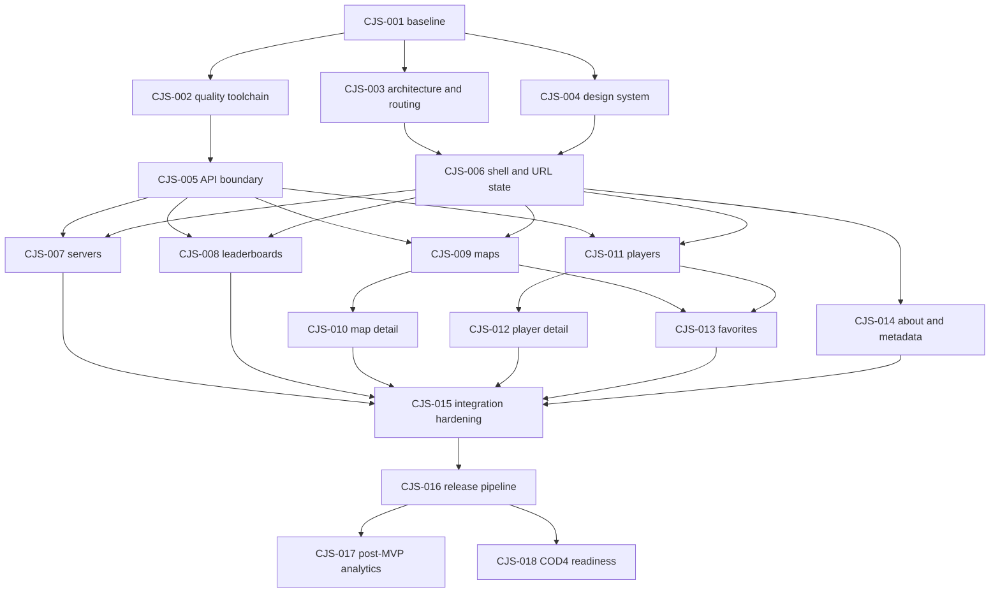

# CJS agent task backlog

This backlog is the executable delivery plan for future agents. Tasks are scoped
to minimize file overlap and may be split further, but their acceptance criteria
must not be weakened.

## Status protocol

Allowed statuses: `queued`, `ready`, `in progress`, `blocked`, `done`. `Queued`
means dependencies are not yet complete; change it to `ready` when they are.

Before coding, an agent must:

1. read `AGENTS.md` and `docs/PROJECT_PLAN.md`;
2. select a `ready` task whose dependencies are `done`;
3. change its status to `in progress` and add an owner/handoff line;
4. inspect relevant code through the codebase-memory MCP graph;
5. keep changes inside the listed boundary or document why expansion is needed.

On handoff, record validation commands and remaining risks. Mark a task `done`
only when all acceptance criteria are met.

## Dependency map



After CJS-005 and CJS-006, CJS-007 through CJS-009 and CJS-011 may run in
parallel. Each feature owns its directory and must consume shared APIs through
public exports rather than editing another feature.

## Foundation

### CJS-001 — Establish repository baseline and identity

- **Status:** done
- **Owner:** Codex / repository bootstrap session
- **Dependencies:** none
- **Primary boundary:** root configuration, package metadata, README, CI/runtime
  scaffolding; no feature redesign
- **Goal:** turn the uncommitted prototype into a reproducible CJS baseline that
  matches the J4L core stack.
- **Work:**
  - Rename package/site metadata from JH Statistics to CJS/CodJumper Stats.
  - Align Node 26, React, TypeScript, Vite, Vite React plugin, and Lucide versions
    with `../j4l-web`; regenerate the npm lockfile with the agreed versions.
  - Confirm strict TypeScript, `npm ci`, `npm run build`, `.gitignore`, environment
    example, Docker Compose/mise, SPA fallback, and Cloudflare dry-run behavior.
  - Ensure generated `dist`, `node_modules`, build info, local agent state, and
    secrets are ignored.
- **Acceptance:** a clean checkout installs with `npm ci`; `npm run build` passes;
  the built app can directly load every current path through its static host;
  package, HTML, and README consistently say CJS.
- **Validation:** `npm ci`; `npm run build`; inspect `git status --short`; run the
  documented local static-host smoke test.
- **Completed 2026-08-15:** CJS metadata and independent About content are in
  place; Node 26/npm 11 are pinned; J4L-aligned dependency ranges and the npm
  lockfile are current; nginx served every current and fallback SPA path with
  HTTP 200; Wrangler 4.114.0 completed a dry run with no bindings or deployment.
- **Completion validation:** `npm ci`; `npm run build`; static Docker image build;
  nginx route matrix; `wrangler deploy --dry-run`; ignore and public-identity
  scans. All passed.

### CJS-002 — Add the quality toolchain and CI gate

- **Status:** done
- **Owner:** Codex / CJS-002 quality-tooling session
- **Dependencies:** CJS-001
- **Primary boundary:** lint/format/test configuration, package scripts, test
  setup, CI workflow
- **Goal:** provide one deterministic local and CI verification command.
- **Work:**
  - Add ESLint for strict TypeScript/React/hooks rules and Prettier.
  - Add Vitest, React Testing Library, user-event, DOM matchers, and request
    mocking suitable for API-driven component tests.
  - Add `format`, `format:check`, `lint`, `typecheck`, `test`, `test:coverage`, and
    `verify` scripts.
  - Make CI use Node 26, `npm ci`, and `npm run verify` with dependency caching.
  - Add a minimal render test that proves the harness, not product behavior.
- **Acceptance:** intentionally malformed formatting, lint, type, and test cases
  fail the appropriate stage; `npm run verify` passes on the repository; CI has
  no sibling-repository or live-API dependency.
- **Validation:** `npm run verify`.
- **Completed 2026-08-15:** Added strict TypeScript/React/hooks/accessibility
  linting, repository-wide Prettier checks, Vitest with React Testing Library,
  user-event, DOM matchers, MSW request interception, V8 coverage, the complete
  package-script surface, Docker/mise parity, and the CI `verify` gate.
- **Completion validation:** isolated malformed formatting, lint, type, and test
  probes each failed their intended gate and were removed; local and clean
  Docker `npm ci` environments both passed `npm run verify` with 5 test files and
  25 tests; dependency audit reported zero vulnerabilities.

### CJS-003 — Introduce feature architecture and real routing

- **Status:** done
- **Owner:** Codex / wave 1 CJS-003
- **Dependencies:** CJS-001
- **Primary boundary:** `src/app`, `src/lib/routing`, route entry points, migration
  shims
- **Goal:** replace one-time pathname branching with reactive, testable routes.
- **Work:**
  - Create the target directories and public module boundaries from the project
    plan without doing page redesigns.
  - Implement a route table for `/`, `/leaderboards`, `/maps`, `/maps/:mapId`,
    `/players`, `/players/:playerId`, `/favorites`, `/about`, and a not-found page.
  - Redirect legacy `/map?mapid=` and `/player?playerid=` URLs.
  - Add an ADR if introducing a router dependency.
  - Preserve direct-load and browser back/forward behavior.
- **Acceptance:** every route is linkable and reactive; legacy links resolve;
  unknown paths render a useful 404; routing tests cover navigation, back/forward,
  direct loading, and redirects.
- **Validation:** routing test suite; `npm run build` (or `npm run verify` after
  CJS-002).
- **Completed 2026-08-15:** Added feature public exports, a typed route table,
  reactive History API navigation, nested map/player detail routes, legacy URL
  replacement redirects, and a useful not-found page without adding a router
  dependency.
- **Completion validation:** focused routing suite (18 tests), full test suite
  (25 tests), scoped ESLint and Prettier checks, `npm run typecheck`,
  `npm run build`, and direct-load HTTP 200 smoke checks for every public,
  nested, and fallback path. All CJS-003 checks passed. The repository-wide
  `npm run verify` remains pending completion of the concurrent CJS-002 and
  CJS-004 slices.

### CJS-004 — Build the J4L-aligned design system

- **Status:** done
- **Owner:** Codex / wave 1 CJS-004
- **Dependencies:** CJS-001
- **Primary boundary:** `src/styles`, `src/components/ui`, component gallery or
  test fixtures
- **Goal:** define the reskin once, before independent feature pages diverge.
- **Work:**
  - Implement tokens from the project plan for color, type, spacing, radii,
    borders, shadows, motion, layers, and breakpoints.
  - Add reset/global styles and primitives for button, link, icon button, input,
    select, segmented control, badge, panel/card, table, skeleton, empty/error
    states, pagination, and visually hidden text.
  - Document responsive table-to-card conventions and focus/error states.
  - Check normal, hover, focus-visible, disabled, loading, and destructive states.
- **Acceptance:** primitives use tokens rather than scattered literals; contrast
  and keyboard focus meet WCAG AA; mobile/desktop examples have no clipping;
  reduced motion is respected.
- **Validation:** component tests, accessibility checks, and visual inspection at
  360px, 768px, and 1440px.
- **Completed 2026-08-15:** added the tokenized J4L-aligned color, typography,
  spacing, shape, elevation, motion, layer, and breakpoint foundation; reset and
  global utilities; the full primitive set; responsive table-to-card behavior;
  usage conventions; and an interactive component gallery.
- **Completion validation:** six focused design-system tests; computed WCAG AA
  contrast checks (minimum tested ratio 5.07:1); Firefox WebDriver inspection at
  360px, 768px, and 1440px with no horizontal overflow; normal, hover,
  focus-visible, disabled, loading, destructive, and reduced-motion state checks;
  and `npm run verify` (25 tests plus production build). All passed.

### CJS-005 — Create the typed API and capability boundary

- **Status:** done
- **Owner:** Codex / wave 1 CJS-005
- **Dependencies:** CJS-002
- **Primary boundary:** `src/lib/api`, API fixtures/tests, shared domain types
- **Goal:** make API changes and malformed payloads fail at one controlled edge.
- **Work:**
  - Implement a configurable JSON client with URL encoding, cancellation,
    structured errors, bounded transient retry policy, and safe status context.
  - Add distinct `Source`, `Game`, `Fps`, and capability types. Initially expose
    `jh|j4l`, `cod2`, and the documented FPS values.
  - Add typed endpoints and normalizers needed by MVP screens: tracker servers,
    leaderboards, maps/tops, players/search/performance/positions/tops/routes, and
    source-compatible J4L rank/activity summaries.
  - Store anonymized representative fixtures and test every normalizer and URL.
  - Publish feature-facing functions through one stable API index.
- **Acceptance:** views never cast response JSON; unsupported capability calls are
  prevented before fetch; malformed fixtures return safe errors/defaults rather
  than crashing; all MVP endpoints have URL and normalization tests.
- **Validation:** API unit/contract suite; `npm run verify`.
- **Completed 2026-08-15:** added the typed `src/lib/api` boundary with distinct
  source/game/FPS/capability types, J4L capability gates, configurable safe GET
  retries, structured errors, cancellation, all MVP endpoint adapters, defensive
  normalizers, anonymized fixtures, stable exports, legacy-screen compatibility,
  and API boundary guidance.
- **Completion validation:** 28 focused API contract tests; 64 repository tests;
  current official OpenAPI and read-only JH/J4L payload compatibility checks; and
  full `npm run verify` (format, lint, typecheck, coverage, production build).
  All passed; API boundary line coverage is 93.17%.

## MVP vertical slices

### CJS-006 — Application shell, navigation, and URL-state helpers

- **Status:** done
- **Owner:** Codex / wave 2 CJS-006
- **Dependencies:** CJS-003, CJS-004
- **Primary boundary:** `src/app`, shell components, `src/lib/routing` URL helpers
- **Goal:** provide the shared frame all feature agents can target.
- **Work:** build the CJS header, desktop/mobile navigation, main landmark,
  footer, skip link, route pending indicator, page container, source context, and
  typed helpers for query-string filter state.
- **Acceptance:** keyboard/mobile navigation works; the active route is conveyed
  without color alone; filters can round-trip through encoded URLs; no copied
  branding or maintainer links remain.
- **Validation:** shell integration tests, accessibility scan, 360px and 1440px
  inspection, `npm run verify`.
- **Completed 2026-08-15:** centralized the responsive CJS shell at the router;
  added the header, desktop/mobile navigation, main landmark, skip link, pending
  indicator, page container, independent footer, and URL-backed source context;
  and published typed, defensive query-state codecs and hooks for feature
  filters.
- **Completion validation:** 27 focused shell/routing tests, axe-core with zero
  violations, keyboard and source URL round-trip integration coverage, Firefox
  inspection at 360px and 1440px with no clipping, and `npm run verify` with 10
  test files and 64 tests. All passed.

### CJS-007 — Live servers experience

- **Status:** done
- **Owner:** Codex / wave 3 CJS-007
- **Dependencies:** CJS-005, CJS-006
- **Primary boundary:** `src/features/servers`
- **Goal:** deliver the home/server dashboard against Tracker endpoints.
- **Work:** source and populated-only filters, manual refresh, optional polling
  with visibility awareness, last-updated/stale status, responsive cards/list,
  player totals, map/server information, copy/connect action only when valid.
- **Acceptance:** all async states are explicit; refresh does not blank successful
  stale data; malformed server payloads cannot crash the page; unsupported game
  filters are not shown.
- **Validation:** server normalizer and component tests with mocked success,
  partial, empty, slow, aborted, and failed responses; `npm run verify`.
- **Completed 2026-08-15:** Replaced the legacy server-page export with a
  feature-owned live dashboard covering URL-backed populated/layout filters,
  source-aware requests and links, manual refresh, optional visibility-aware
  polling, last-updated/stale feedback, responsive grid/list cards, player and
  map details, defensive partial-payload handling, and validated copy-address
  actions. Unsupported COD4/game-version controls are not rendered.
- **Contract evidence:** Checked `https://api.jump4life.org/docs` and the live
  OpenAPI contract on 2026-08-15. `/api/v1/tracker/servers` documents only the
  shared `source` parameter; its JSON response schema remains open (`{}`), so
  the feature consumes the typed CJS API boundary and applies a second safe
  display-model normalization step.
- **Completion validation:** 21 focused server model/component tests passed,
  including success, partial, empty, slow, aborted, failed, stale-refresh,
  malformed-payload, URL-state, visibility-polling, and axe coverage;
  `npm run verify` passed with 19 test files and 117 tests. Firefox layout
  inspection found no horizontal overflow at a constrained 360px content width
  or a 1440px desktop viewport.
- **Remaining risk:** The upstream Tracker JSON schema is not structurally
  specified in OpenAPI; unexpected future fields are safely ignored, while
  missing required transport fields surface the explicit error state.

### CJS-008 — Leaderboards experience

- **Status:** done
- **Owner:** Codex / CJS-008 leaderboards session
- **Dependencies:** CJS-005, CJS-006
- **Primary boundary:** `src/features/leaderboards`
- **Goal:** make supported competitive boards searchable and shareable.
- **Work:** source, board, FPS, pagination/limit, sorting where valid, player links,
  responsive table/cards, and capability-gated J4L rank XP. Retain region/time
  controls only if the API contract/data proves them meaningful.
- **Acceptance:** invalid URL combinations normalize predictably; rank XP cannot
  be selected for `jh`; changing controls updates the URL and result; table
  headers and ranking semantics are accessible.
- **Validation:** parameter matrix and UI tests; direct-load representative URLs;
  `npm run verify`.
- **Completed 2026-08-15:** Replaced the legacy page export with a typed
  leaderboards feature covering canonical URL-backed board/FPS/search/page-size/
  page/sort state; capability-safe J4L rank XP; cancellation-aware loading,
  refresh, stale, empty, and error states; stable player links; and accessible
  official-rank semantics in a responsive table/card presentation. Documented
  the live API contract at `https://api.jump4life.org/docs` and omitted the
  unsupported prototype region/time controls.
- **Completion validation:** Fourteen focused parameter-matrix and UI tests
  passed, including representative direct loads, request cancellation, URL
  normalization, sorting, paging, error/empty states, player links, and an
  axe-core scan. Repository-wide `npm run verify` passed with 19 test files and
  117 tests.
- **Remaining risk:** Automated 390px/1440px image capture was attempted, but
  concurrent stuck Firefox jobs prevented a clean screenshot in this session;
  the shared 48rem table-to-card rules, feature breakpoints, and semantic UI
  tests passed, but a later manual visual smoke check is still worthwhile.

### CJS-009 — Maps discovery experience

- **Status:** done
- **Owner:** Codex / CJS-009 maps session
- **Dependencies:** CJS-005, CJS-006
- **Primary boundary:** `src/features/maps` excluding detail-specific components
- **Goal:** provide fast map discovery with durable filters.
- **Work:** source, search, route type, media availability when supported, FPS
  difficulty, sort options based on real fields, responsive view mode, result
  count, favorites action, and links to stable detail routes.
- **Acceptance:** filter/sort combinations are deterministic and URL-backed;
  missing images/metadata degrade gracefully; large lists avoid repeated
  expensive transforms; keyboard users can reach all map actions.
- **Validation:** filter/sort unit tests, map list integration tests, mobile and
  desktop inspection, `npm run verify`.
- **Completed 2026-08-15:** Replaced the legacy list page with a typed maps
  feature slice covering URL-backed source/search/type/media/FPS/difficulty/sort,
  list/grid view and pagination; deterministic prepared-data transforms;
  cancellation-aware loading, refresh, stale, empty and error states; resilient
  metadata presentation; favorites actions; and source-stable detail links.
- **Completion validation:** Seven focused map tests passed; repository-wide
  `npm run verify` passed with 19 test files and 117 tests; headless visual
  inspection passed at 390×844 and 1440×1000 viewports.
- **Follow-up resolved:** CJS-013 replaced the temporary favorite adapter;
  CJS-010 owns the completed map-detail behavior.

### CJS-010 — Map detail and top runs

- **Status:** done
- **Owner:** Codex / CJS-010 map-detail session
- **Dependencies:** CJS-009
- **Primary boundary:** map detail files within `src/features/maps`
- **Goal:** turn `/maps/:mapId` into a complete, shareable map record.
- **Work:** metadata summary, available FPS/checkpoint selection, top runs,
  player links, source context, valid media/replay links if supplied, and a clear
  unavailable map state.
- **Acceptance:** route changes cancel obsolete requests; selected FPS/checkpoint
  is shareable; no stale run list is presented as another map's data; missing
  fields do not produce broken labels.
- **Validation:** route/data race tests, API error states, deep-link smoke test,
  `npm run verify`.
- **Completed 2026-08-15:** Replaced the legacy detail export with a feature-owned
  map record covering source-stable metadata, URL-backed FPS/checkpoint
  selection, checkpoint-aware top runs, safe player links and plain COD names,
  validated media URLs, favorites continuity, and explicit loading, unavailable,
  catalog-error, run-error, and empty states. Map and run requests are separately
  keyed and cancelled so stale route or selection data is never relabeled.
- **Contract evidence:** Rechecked the live API docs, OpenAPI contract, and
  non-identifying payload structure on 2026-08-15. `/api/v1/map/all` documents
  `source`; `/api/v1/map/tops` documents `source`, `fps`, `cpid`, and optional
  `limit`. The contract supplies no replay URL, so the UI does not invent one and
  only exposes HTTP(S) map media URLs actually present in normalized data.
- **Completion validation:** Eleven focused model/component tests passed,
  including route and FPS races, request cancellation, URL checkpoint state,
  partial endpoint failure, unavailable/error states, and a direct nested-route
  load. Repository-wide `npm run verify` passed with 26 test files and 156 tests.
  Headless Firefox found no document overflow in the 390px loading state, the
  fully rendered 500px compact record/table, or the 1440px desktop record/table.
- **Remaining risk:** The live J4L top-runs endpoint can return HTTP 500 for an
  otherwise valid checkpoint; the map remains usable and the failure is confined
  to a retryable runs panel. Replay links remain omitted until the API publishes
  a URL contract.

### CJS-011 — Player discovery experience

- **Status:** done
- **Owner:** Codex / CJS-011 players session
- **Dependencies:** CJS-005, CJS-006
- **Primary boundary:** `src/features/players` excluding profile-specific files
- **Goal:** make players discoverable without overwhelming the browser or API.
- **Work:** source-aware name search, documented list metadata, stable sorting,
  COD color rendering with accessible text, badges only when backed by data,
  favorites action, responsive result view, and profile links.
- **Acceptance:** search is debounced/cancelled as appropriate; unsafe game color
  input is rendered as text spans only; unsupported inferred badges are removed;
  result state is URL-backed.
- **Validation:** search race tests, name/color parser tests, component tests,
  `npm run verify`.
- **Completed 2026-08-15:** Replaced the eager legacy directory with a typed
  player feature that uses the bounded, source-aware name endpoint; debounces
  and cancels obsolete requests; keeps search/source/sort state shareable;
  presents documented country, visits, and last-seen metadata; renders COD color
  controls as accessible React text spans; omits inferred role/status badges;
  and provides source-stable profile links and favorites actions.
- **Completion validation:** Eleven focused parser, stable-sort, request-race,
  URL-state, safety, favorites, and component tests passed. Repository-wide
  `npm run verify` passed with 19 test files and 117 tests; headless visual
  inspection passed at 390×844 and 1440×1000 viewports with no horizontal
  clipping or lost controls.
- **Follow-up resolved:** CJS-013 replaced the temporary favorite adapter;
  CJS-012 owns the completed profile behavior.

### CJS-012 — Player profile and performance

- **Status:** done
- **Owner:** Codex / CJS-012 player-profile session
- **Dependencies:** CJS-011
- **Primary boundary:** profile files within `src/features/players`
- **Goal:** provide a stable profile view that adapts to each source's capability.
- **Work:** identity/activity summary, performance stats, leaderboard positions,
  top runs, route completion, J4L rank/activity summary, source switch behavior,
  map links, and unavailable/deleted player handling.
- **Acceptance:** requests cancel on player/source changes; J4L-only sections are
  capability-gated; partial endpoint failure leaves unaffected sections usable;
  heading/landmark order remains coherent.
- **Validation:** partial-failure integration tests, capability matrix, deep-link
  smoke test, `npm run verify`.
- **Handoff:** Replaced the legacy profile export with a feature-owned,
  responsive profile view. Common and J4L-only endpoints settle independently,
  keep stale data visible during refresh failures, and abort on superseding
  player/source/filter requests. Source, FPS, and leaderboard choices remain in
  the URL; top-run checkpoint links and route-completion map links use their
  corresponding map lookup contracts. Invalid links, API `404` responses, empty
  sections, and partial/all-endpoint failures have deliberate UI states.
- **Contract evidence:** Checked `https://api.jump4life.org/docs` and the live
  OpenAPI contract on 2026-08-15. Profile endpoint/parameter and capability notes
  are recorded in `src/features/players/README.md`; XP rank and activity summary
  remain capability-gated to `source=j4l`.
- **Tests:** Added focused profile model and integration coverage for deep-linked
  filters, source capability gating, map links, partial failure, request
  cancellation, deleted/unavailable players, and malformed player IDs. All 152
  tests across 25 files pass through `npm run verify`.

### CJS-013 — Versioned favorites

- **Status:** done
- **Owner:** Codex / CJS-013 favorites integration session
- **Dependencies:** CJS-009, CJS-011
- **Primary boundary:** `src/features/favorites`, `src/lib/storage`, favorite
  controls exposed by maps/players
- **Goal:** make local favorites reliable across schema changes and sources.
- **Work:** versioned storage schema keyed by entity type/source/id, safe parser
  and migration, add/remove/clear operations, cross-tab updates, unavailable
  entity behavior, maps/players tabs, and empty state.
- **Acceptance:** malformed storage never crashes startup; same numeric ID from
  two sources cannot collide; actions are keyboard-accessible and update across
  open tabs; migration tests preserve valid legacy entries.
- **Validation:** storage/migration unit tests, cross-tab integration test,
  `npm run verify`.
- **Completed 2026-08-15:** Added a source-qualified version 1 favorites document,
  safe parsing and legacy-key migration, add/remove/toggle/type-clear operations,
  same-tab and cross-tab subscriptions, and an unavailable-snapshot fallback.
  Rewired map discovery/detail and player search/profile controls to the shared
  store. Replaced the legacy screen with feature-owned URL-backed keyboard tabs,
  source-aware map/player cards, individual and group removal, empty states,
  live counts, and explicit stale/local-data guidance.
- **Completion validation:** Four storage/migration/cross-tab tests and three
  favorites page tests pass, including source-collision, unavailable-entry,
  keyboard navigation, and axe-core coverage. The six affected map/player suites
  also pass. Repository-wide `npm run verify` passes with 28 test files and 163
  tests, plus the production build.
- **Remaining risk:** Firefox screenshot validation at 390×844 and 1440×1000 was
  attempted with populated source-collision and unavailable-entry fixtures, but
  the environment's headless software compositor could not map a framebuffer.
  Responsive CSS, semantic rendering, keyboard behavior, and axe-core checks
  passed; a later manual visual smoke check remains worthwhile.

### CJS-014 — About, metadata, and public-project content

- **Status:** done
- **Owner:** Codex / CJS-014 about-and-metadata session
- **Dependencies:** CJS-006
- **Primary boundary:** `src/features/about`, document metadata, public static
  metadata assets
- **Goal:** clearly explain CJS ownership, data provenance, and limitations.
- **Work:** independently written about page, links approved by the owner, API and
  community attribution, privacy/local-storage note, open-source repository link,
  per-route titles/descriptions, favicon/social metadata using owned assets.
- **Acceptance:** no reference-site maintainer data or wording remains; links are
  valid and safe; every route has a useful title; local-storage/API behavior is
  accurately described.
- **Validation:** metadata/content tests, link review, `npm run verify`.
- **Completed 2026-08-15:** Replaced the legacy About export with a feature-owned,
  independently written page covering CJS ownership, public API provenance,
  browser-local favorites, supported source/game scope, capability limitations,
  and verified public project/API/community links. Added route-aware title,
  description, canonical, Open Graph, and Twitter metadata plus owned favicon,
  manifest, and social-card assets.
- **Completion validation:** Nineteen focused content, metadata, routing, and axe
  tests passed; all four external links returned HTTP 200; Firefox inspection at
  390×844 and 1440×1000 found no clipping; `npm run verify` passed with 25 test
  files and 152 tests.

## Integration and release

### CJS-015 — Accessibility, responsive, and end-to-end hardening

- **Status:** done
- **Owner:** Codex / CJS-015 integration-hardening session
- **Dependencies:** CJS-007, CJS-008, CJS-010, CJS-012, CJS-013, CJS-014
- **Primary boundary:** cross-feature fixes, E2E configuration/tests, performance
  budgets
- **Goal:** make the assembled MVP dependable as one product.
- **Work:** critical-path browser tests, automated accessibility checks, manual
  keyboard/zoom/reduced-motion review, small/large viewport pass, slow/error
  network pass, route-level lazy loading where valuable, image/layout-shift
  review, and removal of dead prototype code.
- **Acceptance:** servers, leaderboards, map discovery/detail, player
  discovery/profile, and favorites smoke flows pass; no serious automated a11y
  violations; no horizontal page overflow at 320px or 200% zoom; production build
  has no unexpected console errors.
- **Validation:** `npm run verify`; E2E suite; documented manual browser matrix;
  production bundle inspection.
- **Completed 2026-08-15:** Added strict production-preview Playwright flows for
  every critical product area across Chromium, Firefox, and WebKit; browser axe,
  console/page-error, 320px, 200%-scale, reduced-motion, keyboard, focus, retry,
  persistence, and nested-refresh checks; route focus/status and chunk-failure
  recovery; mobile sorting and contrast fixes; keyed async cancellation; lazy
  feature routes; enforced manifest-based bundle budgets; and dead prototype/CSS
  removal.
- **Completion validation:** `npm run verify` passes with 30 Vitest files and 167
  tests, the 27-test three-engine browser matrix passes, and every production
  bundle metric remains below its checked ceiling. The browser/manual review and
  measurements are recorded in [CJS-015-VALIDATION.md](CJS-015-VALIDATION.md).
- **Remaining risk:** The headless environment cannot provide a physical screen
  reader session. Live-region content, focus behavior, semantic markup, browser
  axe results, and three-engine behavior are covered; an NVDA/Firefox or
  VoiceOver/Safari listening smoke remains worthwhile before public release.

### CJS-016 — Public release and deployment pipeline

- **Status:** done
- **Owner:** Codex / CJS-016 public-release session
- **Dependencies:** CJS-015
- **Primary boundary:** GitHub workflows, Cloudflare configuration, release docs;
  production mutation requires explicit owner authorization
- **Goal:** make public contributions and owner-controlled releases safe.
- **Work:** finalize CODEOWNERS/Dependabot, PR template, security/contribution
  guidance, CI branch gate, Cloudflare dry run, SPA asset caching/headers, source
  maps policy, release checklist, rollback notes, and production domain decision.
- **Acceptance:** a fork can build/test without secrets or sibling repos;
  deployment remains disabled by default until owner configuration; dry run
  succeeds; no credentials or internal artifacts are tracked.
- **Validation:** fresh-checkout `npm ci && npm run verify`; Wrangler dry run;
  workflow syntax/security review. Do not deploy without explicit approval.
- **Completed 2026-08-15:** Added owner-review boundaries, grouped Dependabot
  updates, contribution/security guidance, a pull request template, an accepted
  release-boundary ADR, and an owner-only release/rollback runbook. Preserved the
  protected `Build and validate` check while extending CI with the three-engine
  browser suite and pinned Cloudflare dry run. Deployment now consumes the exact
  successful `main` revision, validates its custom-domain/secrets configuration,
  remains kill-switch gated, and performs a post-deploy route/header/cache smoke.
  Added Cloudflare/nginx security headers, immutable fingerprinted-asset caching,
  explicit no-source-map policy, upload exclusions, and enforced release-artifact
  checks. Enabled GitHub private vulnerability reporting.
- **Completion validation:** An isolated source copy passed `npm ci` and
  `npm run verify` with 30 test files / 167 tests; Wrangler 4.114.0 strict dry run
  succeeded with no bindings or deployment; actionlint, gitleaks, npm audit,
  Docker/nginx syntax, nested SPA fallback, security-header, and immutable-cache
  checks passed. Evidence and owner-only first-release actions are recorded in
  [CJS-016-VALIDATION.md](CJS-016-VALIDATION.md).
- **Owner decisions before first release:** publish a license before accepting
  outside code, choose the dashboard-managed HTTPS domain, set
  `CJS_PRODUCTION_URL` and least-privilege production secrets, then explicitly
  authorize enabling the currently false deployment gate. No production release
  or Cloudflare configuration mutation was performed for this task.

## Post-MVP

### CJS-017 — Replay, activity, and historical analytics

- **Status:** queued
- **Dependencies:** CJS-016
- **Primary boundary:** new feature modules and their API extensions
- **Goal:** expose the remaining documented Replay/Historical/J4L activity value
  without bloating MVP screens.
- **Work:** validate product designs against real payload fixtures, split features
  into independently lazy-loaded routes/panels, add accessible chart/table
  alternatives, pagination, and source capability rules.
- **Acceptance:** each shipped endpoint has contract fixtures/tests; charts have a
  textual/table equivalent; large histories are bounded and cancellable.
- **Validation:** API tests, feature tests, E2E route smoke tests, performance and
  accessibility checks.

### CJS-018 — COD4 capability implementation

- **Status:** blocked
- **Dependencies:** CJS-016 and a published backend COD4 contract/test data
- **Blocker:** the inspected OpenAPI contract exposes `source=jh|j4l` and no COD4
  request capability.
- **Primary boundary:** capability model, compatible feature filters/views, API
  extensions
- **Goal:** add COD4 only from an explicit backend contract, not assumptions made
  from the old reference UI.
- **Work:** document the backend contract, add anonymized COD4 fixtures, extend
  game/source capability matrices, show game selectors only where valid, and
  verify COD2 behavior remains unchanged.
- **Acceptance:** every COD4 request/field is contract-backed; mixed-source/game
  URLs validate predictably; COD2 regression suite passes; unsupported feature
  gaps are communicated honestly.
- **Validation:** contract/unit/integration/E2E matrix for COD2 and COD4;
  `npm run verify`.

## Agent handoff template

```md
Task: CJS-###
Status: in progress | blocked | done
Owner: <agent/session>
Changed scope: <files/modules>
Validation: <commands and results>
Decisions: <brief list or ADR link>
Remaining work/risks: <specific next actions>
```
